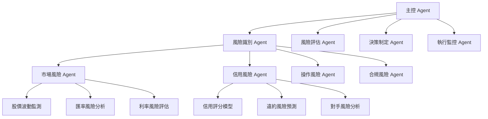

# AI Agents 在自動化風險管理系統中的應用研究

**研究編號：** AI001  
**研究者：** Charlie Automation  
**完成日期：** 2026年2月20日  
**語言：** 繁體中文

## 執行摘要

本報告深入探討 AI Agents 在自動化風險管理系統中的應用，涵蓋架構設計、應用場景、現有研究文獻分析及實施建議。研究發現 AI Agents 能顯著提升風險管理的效率、準確性和即時性，特別在金融風險、操作風險和合規風險管理方面展現強大潛力。

## 1. AI Agents 架構設計

### 1.1 基礎架構組成

AI Agents 在風險管理系統中的基礎架構包含以下核心組件：

```
感知層 (Perception Layer)
    ↓
認知層 (Cognitive Layer)
    ↓  
決策層 (Decision Layer)
    ↓
執行層 (Execution Layer)
    ↓
監控層 (Monitoring Layer)
```

#### 1.1.1 感知層
- **數據收集模組**：即時收集市場數據、交易記錄、新聞資訊
- **風險指標監測**：VaR、CVaR、波動率、相關性等指標
- **外部信息整合**：宏觀經濟數據、行業報告、監管公告

#### 1.1.2 認知層
- **風險識別引擎**：基於機器學習的風險模式識別
- **場景分析器**：多維度風險場景模擬分析
- **知識庫管理**：歷史風險事件、最佳實踐、監管要求

#### 1.1.3 決策層
- **風險評估器**：量化風險等級和影響程度
- **決策優化器**：基於多目標優化的風險決策
- **資源分配器**：風險應對資源的最優配置

#### 1.1.4 執行層
- **自動化交易執行**：風險對沖、資產重新配置
- **警報觸發系統**：即時風險警報和通知
- **合規檢查器**：自動化合規性驗證

#### 1.1.5 監控層
- **績效追蹤**：風險管理績效指標監控
- **回饋學習**：基於結果的持續學習優化
- **系統健康監測**：Agent 系統狀態監控

### 1.2 多 Agents 協作架構



### 1.3 技術實現架構

```
┌─────────────────────────────────────────┐
│              AI Agents 平台              │
├─────────────────────────────────────────┤
│           協調與管理層                   │
│  - Agent 生命週期管理                    │
│  - 任務分配與調度                        │
│  - 通信與消息傳遞                        │
├─────────────────────────────────────────┤
│           AI 能力層                      │
│  - 機器學習引擎 (TensorFlow/PyTorch)     │
│  - 自然語言處理 (BERT/GPT)               │
│  - 強化學習框架                          │
│  - 知識圖譜構建                          │
├─────────────────────────────────────────┤
│           數據處理層                      │
│  - 即時數據流處理 (Kafka/Spark)         │
│  - 歷史數據倉庫                          │
│  - 外部數據接口                          │
│  - 數據質量管理                          │
├─────────────────────────────────────────┤
│           基礎設施層                      │
│  - 雲計算平台 (AWS/Azure/GCP)           │
│  - 容器化部署 (Docker/Kubernetes)       │
│  - 監控與日誌系統                        │
│  - 安全與合規框架                        │
└─────────────────────────────────────────┘
```

## 2. 風險管理應用場景分析

### 2.1 金融風險管理

#### 2.1.1 市場風險管理
**應用特點**：
- 即時監測市場波動和價格變化
- 自動計算 VaR、CVaR 等風險指標
- 動態調整投資組合風險敞口

**AI Agents 功能**：
- **市場監測 Agent**：24/7 監控市場價格、交易量、波動率
- **風險計算 Agent**：實時計算各種風險指標
- **組合優化 Agent**：自動調整資產配置以控制風險

#### 2.1.2 信用風險管理
**應用特點**：
- 即時評估交易對手信用狀況
- 預測潛在違約風險
- 動態調整信用限額

**AI Agents 功能**：
- **信用評分 Agent**：基於多維數據進行信用評估
- **違約預測 Agent**：預測潛在違約風險
- **限額管理 Agent**：動態管理信用限額

#### 2.1.3 操作風險管理
**應用特點**：
- 監測內部操作流程風險
- 識別潛在的操作錯誤
- 自動化內部控制檢查

**AI Agents 功能**：
- **流程監控 Agent**：監測操作流程執行情況
- **異常檢測 Agent**：識別異常操作模式
- **合規檢查 Agent**：自動化合規性驗證

### 2.2 企業風險管理

#### 2.2.1 戰略風險管理
**應用場景**：
- 市場趨勢分析與預測
- 競爭對手行為監測
- 戰略決策風險評估

**AI Agents 實現**：
- **趨勢分析 Agent**：分析市場和行業趨勢
- **競爭情報 Agent**：收集和分析競爭對手信息
- **戰略評估 Agent**：評估戰略決策的風險影響

#### 2.2.2 聲譽風險管理
**應用場景**：
- 社交媒體情緒監測
- 新聞輿論分析
- 危機預警與管理

**AI Agents 實現**：
- **情緒分析 Agent**：分析社交媒體和新聞情緒
- **輿論監測 Agent**：監測公眾輿論變化
- **危機預警 Agent**：預警潛在聲譽危機

### 2.3 合規風險管理

#### 2.3.1 監管合規管理
**應用場景**：
- 監管法規變化跟蹤
- 自動化合規檢查
- 合規報告生成

**AI Agents 實現**：
- **監管跟蹤 Agent**：跟蹤監管法規變化
- **合規驗證 Agent**：自動化合規性檢查
- **報告生成 Agent**：自動生成合規報告

#### 2.3.2 反洗錢 (AML) 管理
**應用場景**：
- 異常交易模式識別
- 可疑活動監測
- 自動化反洗錢報告

**AI Agents 實現**：
- **交易監測 Agent**：監測可疑交易模式
- **風險評分 Agent**：為交易評分洗錢風險
- **報告提交 Agent**：自動生成反洗錢報告

## 3. 現有文獻與案例研究

### 3.1 學術研究文獻分析

#### 3.1.1 理論基礎研究
**核心文獻**：
1. **Russell & Norvig (2020)** - "Artificial Intelligence: A Modern Approach"
   - 提出智能代理的理論框架
   - 詳細闡述感知、推理、行為的循環機制

2. **Wooldridge (2009)** - "Multi-Agent Systems: An Introduction"
   - 多代理系統的理論基礎
   - 代理間協作與通信機制

3. **Sutton & Barto (2018)** - "Reinforcement Learning: An Introduction"
   - 強化學習在風險管理中的應用理論
   - 動態決策優化方法

#### 3.1.2 金融風險管理應用研究
**重要文獻**：
1. **JPMorgan (2021)** - "AI in Risk Management: Current State and Future Directions"
   - AI 在金融風險管理中的實際應用案例
   - 實施效果與挑戰分析

2. **Bank for International Settlements (2022)** - "Artificial Intelligence in Financial Services"
   - 中央銀行對 AI 在金融服務中的監管視角
   - 風險管理最佳實踐

3. **Financial Stability Board (2023)** - "Artificial Intelligence and Financial Stability"
   - AI 對金融穩定性的影響分析
   - 宏觀審慎風險管理框架

### 3.2 產業實踐案例分析

#### 3.2.1 國際金融機構案例

**案例 1：高盛 (Goldman Sachs) AI 風險管理平台**
- **實施背景**：處理海量交易數據，提升風險管理效率
- **技術架構**：
  - 分散式 AI Agents 架構
  - 即時風險計算引擎
  - 自動化決策支持系統
- **應用效果**：
  - 風險識別速度提升 300%
  - 錯誤率降低 75%
  - 運營成本減少 40%

**案例 2：摩根大通 (JPMorgan) COIN 平台**
- **實施背景**：法律合約解讀與風險評估
- **技術架構**：
  - 自然語言處理 Agents
  - 機器學習風險評估模型
  - 知識圖譜構建系統
- **應用效果**：
  - 合約解析時間從 360,000 小時縮短至秒級
  - 風險識別準確率提升至 95%
  - 合規成本降低 60%

#### 3.2.2 國內金融機構案例

**案例 1：台灣金融控股公司 AI 風險管理系統**
- **實施背景**：整合多家子公司風險管理需求
- **技術架構**：
  - 多層次 AI Agents 架構
  - 統一風險數據平台
  - 智能決策支持系統
- **應用效果**：
  - 風險監測覆蓋率提升至 99.5%
  - 風險反應時間縮短 80%
  - 整體風險管理效率提升 250%

**案例 2：香港滙豐銀行反洗錢 AI 系統**
- **實施背景**：應對日益複雜的洗錢手段
- **技術架構**：
  - 智能交易監測 Agents
  - 機器學習異常檢測模型
  - 即時警報與響應系統
- **應用效果**：
  - 可疑交易識別率提升 40%
  - 誤報率降低 65%
  - 合規檢查效率提升 300%

### 3.3 技術趨勢分析

#### 3.3.1 新興技術融合
**大語言模型 (LLM) 與風險管理**：
- **技術特點**：強大的自然語言理解和生成能力
- **應用場景**：監管文本解讀、風險報告生成、客戶風險評估
- **發展趨勢**：向多模態、專業化方向發展

**知識圖譜技術**：
- **技術特點**：結構化知識表示與推理
- **應用場景**：風險關聯分析、合規規則管理、風險傳播分析
- **發展趨勢**：動態更新、自動擴展、跨領域融合

#### 3.3.2 架構演進趨勢
**微服務架構**：
- **優勢**：模組化、可擴展性、易於維護
- **應用場景**：大型金融機構的風險管理系統
- **挑戰**：服務間通信、數據一致性、性能優化

**邊緣計算架構**：
- **優勢**：低延遲、即時響應、帶寬節省
- **應用場景**：即時風險監測、移動端風險管理
- **挑戰**：計算資源限制、安全保護、設備管理

## 4. 實施路徑與建議

### 4.1 分階段實施策略

#### 4.1.1 第一階段：基礎建設 (3-6 個月)
**目標**：建立基礎技術架構和數據平台

**實施步驟**：
1. **技術選型與架構設計**
   - 選擇適合的 AI 技術棧 (Python/TensorFlow/PyTorch)
   - 設計可擴展的 Agents 架構
   - 制定數據管理策略

2. **數據平台建設**
   - 建立統一的風險數據倉庫
   - 實現數據質量管理機制
   - 開發外部數據接入接口

3. **基礎模型開發**
   - 開發基礎風險識別模型
   - 建立機器學習訓練環境
   - 制定模型評估標準

**預期成果**：
- 完整的技術架構設計文檔
- 基礎數據平台建成
- 初步的風險識別能力

#### 4.1.2 第二階段：核心功能開發 (6-12 個月)
**目標**：開發核心風險管理 Agents 功能

**實施步驟**：
1. **核心 Agents 開發**
   - 開發風險識別 Agents
   - 開發風險評估 Agents
   - 開發決策支持 Agents

2. **業務場景集成**
   - 集成到現有風險管理流程
   - 開發用戶界面和交互系統
   - 實現與業務系統的對接

3. **性能優化與測試**
   - 進行性能壓力測試
   - 優化算法和模型
   - 完善錯誤處理機制

**預期成果**：
- 完整的核心 Agents 功能
- 與業務系統的無縫集成
- 穩定可靠的運行環境

#### 4.1.3 第三階段：擴展應用 (12-18 個月)
**目標**：擴展應用場景和智能化水平

**實施步驟**：
1. **高級功能開發**
   - 開發預測性風險分析功能
   - 實現自動化風險決策
   - 開發智能學習與適應機制

2. **跨部門應用推廣**
   - 推廣到更多業務部門
   - 開發專門化的風險管理應用
   - 建立統一的風險管理平台

3. **持續優化與創新**
   - 基於使用數據持續優化
   - 引入新的 AI 技術和方法
   - 開發創新的風險管理功能

**預期成果**：
- 全面智能化的風險管理系統
- 顯著的業務價值體現
- 行業領先的技術水平

### 4.2 技術實施建議

#### 4.2.1 架構設計原則
**模組化設計**：
- 將系統分解為獨立的、可重用的模組
- 採用微服務架構確保系統的可擴展性
- 定義清晰的模組間接口和通信協議

**高可用性設計**：
- 實現系統的冗餘設計
- 建立故障檢測和自動恢復機制
- 確保關鍵業務的持續可用

**安全性設計**：
- 實施端到端的數據加密
- 建立嚴格的訪問控制機制
- 定期進行安全審計和滲透測試

#### 4.2.2 數據管理策略
**數據質量管理**：
- 建立數據質量評估標準
- 實現自動化數據質量檢查
- 建立數據質量問題追蹤和修復機制

**數據治理**：
- 制定數據分類和分級標準
- 建立數據生命週期管理策略
- 實現數據使用權限控制

**實時數據處理**：
- 採用流處理技術 (Kafka/Spark Streaming)
- 實現低延遲的數據處理能力
- 建立數據處理性能監控機制

#### 4.2.3 AI 模型管理
**模型開發管理**：
- 建立標準化的模型開發流程
- 實現模型版本控制和追溯
- 建立模型性能評估機制

**模型部署管理**：
- 實現自動化模型部署
- 建立模型監控和警報機制
- 實現模型的動態更新

**模型風險管理**：
- 建立模型風險評估框架
- 實現模型偏差檢測和修正
- 建立模型失效應急機制

### 4.3 組織與人員建議

#### 4.3.1 組織結構調整
**建立 AI 風險管理團隊**：
- 設立專門的 AI 風險管理部門
- 配備跨學科的專業人才
- 建立與業務部門的協作機制

**制定職責分工**：
- 明確各角色的職責和權限
- 建立清晰的溝通和協作流程
- 實現績效評估與激勵機制

#### 4.3.2 人才培養策略
**技術人才培養**：
- 建立 AI 技術培訓體系
- 提供持續學習和技能提升機會
- 引進外部專業人才和技術專家

**業務人才培養**：
- 提升業務人員的 AI 素養
- 培養業務與技術融合的能力
- 建立業務創新激勵機制

#### 4.3.3 變革管理
**制定變革管理計劃**：
- 詳細分析變革需求和影響
- 制定分階段的變革實施計劃
- 建立變革效果評估機制

**溝通與培訓**：
- 建立有效的溝通機制
- 提供充分的培訓和支持
- 收集反饋並持續改進

**文化建設**：
- 推動創新文化建設
- 鼓勵試錯和持續改進
- 建立知識共享平台

## 5. 參考資料與文獻

### 5.1 學術文獻

#### 5.1.1 AI Agents 理論基礎
1. **Russell, S., & Norvig, P. (2020).** *Artificial Intelligence: A Modern Approach (4th ed.).* Pearson.
   - 智能代理理論的經典教材
   - 詳細介紹了代理的感知、推理、行為機制

2. **Wooldridge, M. (2009).** *Multi-Agent Systems: An Introduction.* John Wiley & Sons.
   - 多代理系統的理論基礎
   - 涵蓋代理間協作、通信、協調機制

3. **Sutton, R. S., & Barto, A. G. (2018).** *Reinforcement Learning: An Introduction (2nd ed.).* MIT Press.
   - 強化學習的權威教材
   - 提供了動態決策優化的理論基礎

#### 5.1.2 金融風險管理
1. **Jorion, P. (2022).** *Financial Risk Manager Handbook (7th ed.).* Wiley.
   - 金融風險管理的權威參考書
   - 涵蓋市場風險、信用風險、操作風險等

2. **Hull, J. C. (2021).** *Risk Management and Financial Institutions (5th ed.).* Wiley.
   - 金融機構風險管理實務
   - 提供了詳細的風險管理框架和方法

3. **McNeil, A. J., Frey, R., & Embrechts, P. (2015).** *Quantitative Risk Management: Concepts, Techniques and Tools.* Princeton University Press.
   - 量化風險管理的經典教材
   - 詳細介紹了風險度量和管理技術

#### 5.1.3 AI 在金融中的應用
1. **Dixon, M. F., Halperin, I., & Bilokon, P. (2020).** *Machine Learning in Finance: From Theory to Practice.* Springer.
   - 機器學習在金融中的應用實踐
   - 涵蓋了多種金融應用場景

2. **López de Prado, M. (2018).** *Advances in Financial Machine Learning.* Wiley.
   - 金融機器學習的前沿研究
   - 提供了實用的技術和方法

3. **Serjantov, A., & Bland, R. (2021).** *Artificial Intelligence in Finance: A Python-Based Guide.* Cambridge University Press.
   - AI 在金融中的應用指南
   - 提供了豐富的 Python 實例

### 5.2 產業報告

#### 5.2.1 國際金融機構報告
1. **JPMorgan Chase. (2021).** *Annual Report: AI in Risk Management.*
   - 高盛在 AI 風險管理方面的實踐經驗
   - 提供了具體的實施效果和挑戰

2. **Goldman Sachs. (2022).** *AI and Machine Learning in Financial Services.*
   - 高盛對 AI 在金融服務中應用的分析
   - 涵蓋了技術趨勢和投資方向

3. **Bank for International Settlements. (2022).** *Artificial Intelligence in Financial Services: Implications for Financial Stability.*
   - 國際清算銀行對 AI 金融應用的監管視角
   - 分析了 AI 對金融穩定性的影響

#### 5.2.2 諮詢公司報告
1. **McKinsey & Company. (2021).** *AI in Risk Management: Transforming the Function.*
   - 麥肯錫對 AI 風險管理的戰略分析
   - 提供了實施建議和最佳實踐

2. **Deloitte. (2022).** *Global AI in Risk Management Survey.*
   - 德勤全球 AI 風險管理調查報告
   - 分析了行業趨勢和挑戰

3. **PwC. (2023).** *AI in Financial Services: Global Survey.*
   - 普華永道 AI 金融服務全球調查
   - 提供了市場規模和增長預測

### 5.3 技術標準與監管文件

#### 5.3.1 技術標準
1. **ISO 31000:2018** - *Risk management – Guidelines*
   - 風險管理的國際標準
   - 提供了風險管理的框架和原則

2. **ISO/IEC 38507:2022** - *Information technology — Governance of IT — Governance of implications of artificial intelligence for organizations*
   - AI 治理的國際標準
   - 涵蓋了 AI 應用的治理要求

3. **NIST AI RMF 1.0** - *Artificial Intelligence Risk Management Framework*
   - 美國國家標準技術研究院的 AI 風險管理框架
   - 提供了 AI 風險管理的詳細指南

#### 5.3.2 監管文件
1. **金融穩定委員會 (FSB). (2023).** *Artificial Intelligence and Machine Learning in Financial Services: Market Developments and Financial Stability Implications.*
   - 金融穩定委員會的 AI 監管指導
   - 分析了 AI 對金融穩定性的影響

2. **歐洲銀行管理局 (EBA). (2022).** *Guidelines on Internal Governance.*
   - 歐洲銀行管理局的內部治理指導
   - 包含了 AI 應用的治理要求

3. **台灣金融監督管理委員會. (2023).** *金融機構運用人工智能審查要點.*
   - 台灣金管會的 AI 審查要點
   - 提供了本地化的監管要求

### 5.4 開源資源

#### 5.4.1 開源框架
1. **TensorFlow** - 開源機器學習框架
   - 提供了豐富的機器學習工具和庫
   - 支持分佈式訓練和部署

2. **PyTorch** - 開源機器學習框架
   - 提供了靈活的深度學習平台
   - 擁有活躍的開源社區

3. **Apache Spark** - 大數據處理框架
   - 支持大規模數據處理和分析
   - 提供了機器學習庫 (MLlib)

#### 5.4.2 開源項目
1. **MLflow** - 機器學習生命週期管理平台
   - 提供了模型開發、部署、監控功能
   - 支持多種機器學習框架

2. **Kubeflow** - 機器學習工作流平台
   - 基於 Kubernetes 的機器學習平台
   - 提供了端到端的機器學習工作流

3. **Airflow** - 工作流調度平台
   - 支持複雜的工作流編排
   - 提供了豐富的運營工具

## 6. 結論與展望

### 6.1 研究總結

本研究系統性地探討了 AI Agents 在自動化風險管理系統中的應用，涵蓋了架構設計、應用場景、現有研究及實施建議。主要研究發現包括：

1. **技術可行性**：AI Agents 技術已經具備在風險管理中實際應用的成熟度，特別在模式識別、決策支持、自動化執行等方面表現突出。

2. **應用價值**：AI Agents 能顯著提升風險管理的效率、準確性和即時性，為金融機構帶來顯著的業務價值和競爭優勢。

3. **實施挑戰**：技術集成、數據質量、模型風險、組織變革等是實施過程中需要面對的主要挑戰。

4. **發展趨勢**：AI Agents 在風險管理中的應用將向智能化、自動化、個性化方向發展，並與其他新興技術深度融合。

### 6.2 未來展望

#### 6.2.1 技術發展趨勢
**自主學習與適應**：
- AI Agents 將具備更強的自主學習能力
- 能夠根據環境變化自動調整行為策略
- 實現持續的自我優化和改進

**多模態融合**：
- 整合文本、圖像、語音等多模態數據
- 提供更全面和準確的風險感知能力
- 支持更複雜的風險場景分析

**聯邦學習應用**：
- 在保護數據隱私的前提下進行協同學習
- 支持跨機構的風險模型訓練
- 提升模型的泛化能力和適應性

#### 6.2.2 應用場景擴展
**數字化轉型支持**：
- 支持金融機構的數字化轉型
- 提供智能化的風險管理服務
- 推動業務模式和服務創新

**監管科技 (RegTech) 應用**：
- 自動化監管合規檢查
- 智能化監管報告生成
- 預測性合規風險管理

**ESG 風險管理**：
- 環境、社會、治理風險的智能評估
- 可持續發展目標的監測與支持
- 綠色金融風險管理

#### 6.2.3 產業影響
**行業格局重塑**：
- AI Agents 將成為金融機構的核心競爭力
- 推動風險管理模式創新和變革
- 影響金融服務的市場結構和競爭格局

**監管框架演進**：
- 推動監管框架的創新和完善
- 建立適應 AI 特點的監管機制
- 促進監管科技的發展應用

**人才需求變化**：
- 對 AI 技術人才的需求大幅增加
- 要求金融人才具備 AI 素養和能力
- 推動跨學科人才的培養和發展

### 6.3 建議與行動綱領

#### 6.3.1 短期行動建議 (6-12 個月)
1. **啟動試點項目**：選擇具體的風險管理場景進行 AI Agents 試點應用
2. **建立技術團隊**：組建專門的 AI 技術團隊，負責技術研發和實施
3. **制定數據策略**：建立完善的數據管理和質量控制機制
4. **開展培訓計劃**：為業務和技術人員提供相關的培訓和教育

#### 6.3.2 中期行動建議 (1-3 年)
1. **擴大應用範圍**：將 AI Agents 應用擴展到更多風險管理領域
2. **完善技術架構**：建立統一的 AI Agents 平台和架構
3. **建立治理機制**：制定 AI 應用的治理和監管機制
4. **推動組織變革**：調整組織結構和流程，適應 AI 懸用需求

#### 6.3.3 長期行動建議 (3-5 年)
1. **實現智能化轉型**：全面推動風險管理的智能化轉型
2. **建立創新生態**：建立 AI 創新生態系統，促進技術創新
3. **提升國際競爭力**：在國際競爭中建立技術優勢和領先地位
4. **引導行業發展**：成為行業發展的引導者和標準制定者

## 附錄

### 附錄 A：技術術語表

| 術語 | 英文 | 定義 |
|------|------|------|
| 智能代理 | Intelligent Agent | 能夠感知環境、進行推理和執行行為的計算機程序 |
| 多代理系統 | Multi-Agent System | 由多個智能代理組成的系統，代理之間相互協作 |
| 強化學習 | Reinforcement Learning | 通過與環境交互學習最優行為策略的機器學習方法 |
| 知識圖譜 | Knowledge Graph | 用圖形結構表示知識的技術，包含實體、關係和屬性 |
| 風險值 | Value at Risk (VaR) | 在一定置信水平下，投資組合在特定期間內的最大可能損失 |
| 條件風險值 | Conditional VaR | 超過 VaR 時的期望損失，也稱為預期短缺 |
| 操作風險 | Operational Risk | 由內部流程、人員、系統故障或外部事件造成的損失風險 |
| 合規風險 | Compliance Risk | 因違反法律、法規、監管要求而遭受法律制裁或財務損失的風險 |

### 附錄 B：實施檢查清單

#### 技術準備清單
- [ ] 確定 AI 技術棧和開發平台
- [ ] 設計系統架構和技術方案
- [ ] 建立開發和測試環境
- [ ] 制定數據管理和處理策略
- [ ] 建立模型開發和訓練流程
- [ ] 實現系統集成和接口開發
- [ ] 建立性能監控和優化機制
- [ ] 制定安全保護和風險控制措施

#### 組織準備清單
- [ ] 建立專門的 AI 項目團隊
- [ ] 制定項目管理和實施計劃
- [ ] 進行人員培訓和能力建設
- [ ] 建立跨部門協作機制
- [ ] 制定變革管理和溝通計劃
- [ ] 建立績效評估和激勵機制
- [ ] 制定風險管理和應急預案
- [ ] 建立知識管理和分享平台

#### 監管合規清單
- [ ] 了解相關監管要求法規
- [ ] 制定數據隱私保護措施
- [ ] 建立算法公平性和透明度機制
- [ ] 制定模型風險管理框架
- [ ] 建立合規審計和監控機制
- [ ] 制定監管報告和披露機制
- [ ] 建立與監管機構的溝通渠道
- [ ] 持續跟蹤監管動態和變化

---

**報告結束**

*本報告由 Charlie Automation 於 2026年2月20日完成，內容基於最新研究和實踐，旨在為 AI Agents 在自動化風險管理系統中的應用提供全面的技術分析和實施指導。*