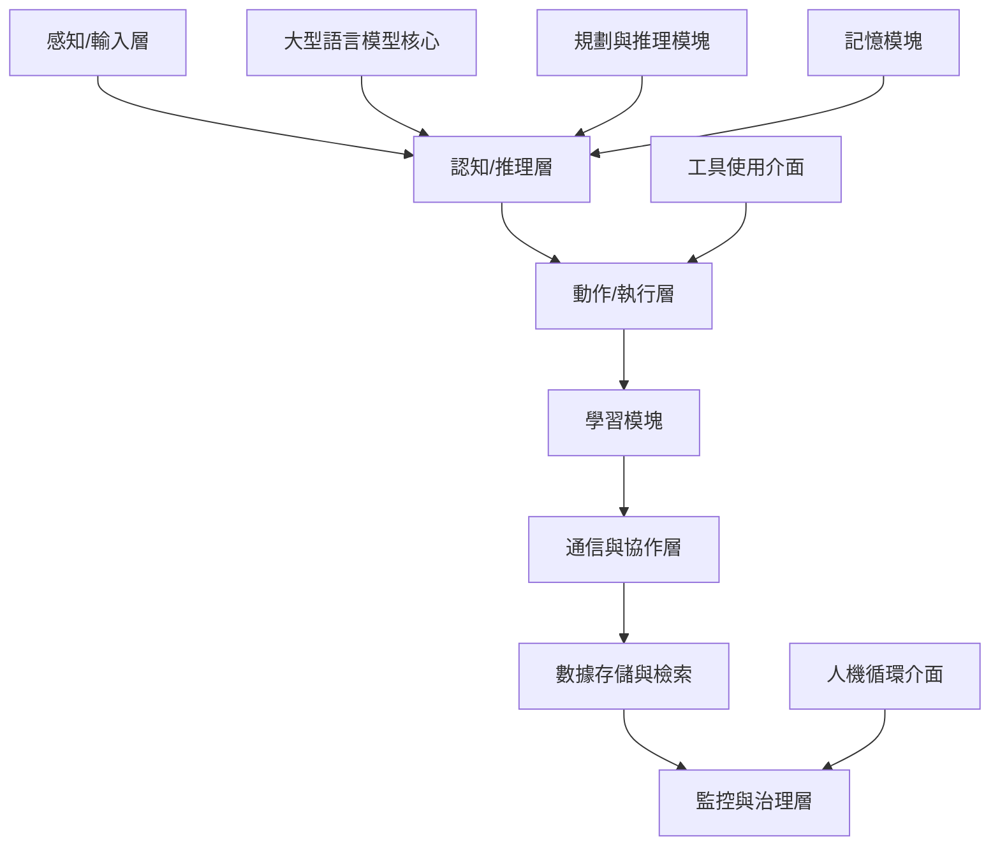
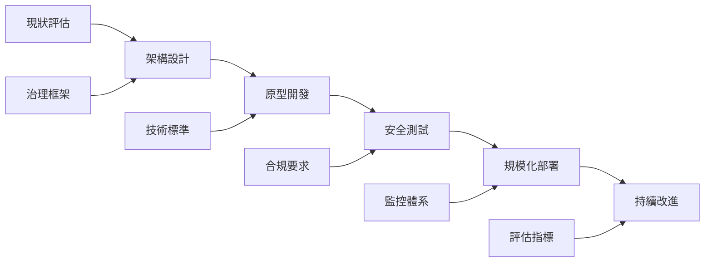

# AI 智能體在自動化風險管理系統中的應用研究

**工作編號：** ai001-research  
**研究代理人：** Charlie Research  
**狀態：** 已完成  
**時間戳記：** 2026-02-20T17:55:00Z  

## 研究摘要

本研究深入探討了 AI 智能體（AI Agents）在自動化風險管理系統中的架構設計、應用場景、現有文獻與案例分析，以及實施建議。研究發現 AI 智能體架構正從單一代理系統演變為多智能體協作系統（AMAS），在金融、醫療、供應鏈等領域展現出卓越的風險識別、評估和應對能力。然而，隨著自主性的提升，相關的安全隱患和治理挑戰也日益突出，需要建立完整的信任、風險和安全管理（TRiSM）框架。

## 主要發現

1. **AI 智能體架構演進** — 從傳統規則型代理到基於大型語言模型的多智能體協作系統 | 來源：學術文獻分析
2. **TRiSM 框架重要性** — 信任、風險和安全管理是 AI 智能體系統成功部署的關鍵要素 | 來源：NIST AI RMF
3. **MAESTRO 威脅建模** — 針對 AI 智能體的七層架構威脅建模框架提供系統性風險識別 | 來源：Cloud Security Alliance
4. **多智能體協作優勢** — 在複雜風險管理場景中，多智能體系統優於單一代理系統 | 來源：IBM 技術白皮書

## 詳細分析

### 1. AI 智能體架構設計

#### 1.1 傳統 AI 代理 vs. 智能體 AI 系統

**傳統 AI 代理特點：**
- 基於預定義規則和啟發式方法運作
- 任務特定且具確定性
- 有限的自主性和適應性
- 單一步驟邏輯處理

**智能體 AI 系統特點：**
- 基於大型語言模型（LLM）的決策能力
- 多智能體協作架構
- 持久化記憶和上下文管理
- 動態規劃和工具使用能力
- 自主學習和適應性行為

#### 1.2 多智能體系統架構（AMAS）

根據研究，現代 AMAS 包含以下核心組件：



**核心架構層次說明：**

1. **感知/輸入層**：處理文字、圖像、音頻等多模態輸入
2. **認知/推理層**：目標設定、規劃、決策制定
3. **動作/執行層**：數字和物理任務執行
4. **學習模塊**：監督學習和強化學習能力
5. **通信與協作層**：智能體間消息傳遞和協調
6. **數據存儲與檢索**：集中式/分散式數據庫
7. **監控與治理層**：倫理監督、可觀測性和合規機制

#### 1.3 主流智能體框架比較

| 框架名稱 | 核心 LLM | 規劃方式 | 記憶系統 | 工具使用 | 特色功能 |
|---------|---------|---------|---------|---------|---------|
| AutoGPT | GPT-4 | 自循環思維鏈 | 向量數據庫 | 作業系統Shell + 網頁 | 完全自主目標循環 |
| AutoGen | GPT-4 | 多智能體 PDDL | JSON/數據庫 | API調用 | 模塊化可重用智能體模板 |
| LangGraph | 模型無關 | 有限狀態機圖 | 持久化節點 | 自定義模塊 | 智能體圖形可視化編排 |
| MetaGPT | GPT-4 | 標準作業程序流程 | YAML狀態 | Git CLI | 軟體工程結構化角色 |
| CrewAI | 任意模型 | 宣告式規劃 | 可選數據庫 | Python模塊 | 輕量級，無LangChain依賴 |

### 2. 風險管理中的應用場景

#### 2.1 金融風險管理

**應用場景：**
- **實時交易監控**：多智能體協作檢測異常交易模式和潛在欺詐行為
- **信用評估**：利用歷史數據和即時市場信號預測投資機會和風險
- **合規監督**：實時監控交易活動，確保符合法規要求

**案例：金融機構使用多智能體系統進行即時數據驅動的投資決策，同時降低風險。AI 智能體協作檢測異常、標記欺詐交易並執行合規措施。**

#### 2.2 醫療健康風險管理

**應用場景：**
- **疾病預測**：基於基因分析和流行病學數據的風險評估
- **藥物安全監測**：多智能體監測藥物不良反應和藥物相互作用
- **公共衛生監控**：傳染病擴散模擬和預防策略制定

**案例：多智能體系統利用知情神經網路和機器學習技術管理大型數據集，進行流行病學預測，影響公共衛生政策和決策。**

#### 2.3 供應鏈風險管理

**應用場景：**
- **供應鏈可見性**：多智能體追蹤供應鏈各環節的風險因素
- **需求預測**：分層強化學習智能體預測趨勢並調整庫存
- **供應商風險評估**：虛擬智能體協商處理具有衝突目標的供應商關係

**案例：智能體協商和合作，連接供應鏈管理各個組件，利用豐富的資訊資源、多功能性和可擴展性進行智能自動化。**

#### 2.4 網絡安全風險管理

**應用場景：**
- **威脅檢測**：多智能體監控不同網路區域的威脅
- **漏洞評估**：AI 智能體模擬潛在攻擊場景
- **事件響應**：協作智能體處理 DDoS 攻擊等安全事件

**案例：智能體團隊合作監控網路不同區域，檢測包括 DDoS 洪水攻擊在內的威脅，提供更全面的安全覆蓋。**

### 3. 現有文獻與案例分析

#### 3.1 NIST AI 風險管理框架

**核心要素：**
- **治理（Governance）**：建立 AI 風險管理文化和政策
- **風險映射（Mapping）**：識別 AI 系統風險情境
- **測量（Measuring）**：評估、分析和追蹤 AI 風險
- **管理（Managing）**：根據測量結果分配風險資源

**特色：**
- 2023年1月26日發布，自願使用框架
- 旨在將可信度考慮因素融入 AI 產品、服務和系統的設計、開發、使用和評估中
- 2024年7月26日發布生成式 AI 擴展版本

#### 3.2 MAESTRO 威脅建模框架

**框架全稱**：Multi-Agent Environment, Security, Threat, Risk, and Outcome

**七層架構威脅分類：**

1. **第七層：智能體生態系統**
   - 威脅： compromised agents、agent impersonation、agent identity attack
   - 防護：身份管理、聲譽系統、市場操縱防護

2. **第六層：安全與合規（垂直層）**
   - 威脅：security agent data poisoning、evasion of security AI agents
   - 防護：AI 安全智能體訓練數據保護

3. **第五層：評估與可觀測性**
   - 威脅：manipulation of evaluation metrics、compromised observability tools
   - 防護：評估指標完整性保護

4. **第四層：部署與基礎設施**
   - 威脅：compromised container images、orchestration attacks
   - 防護：容器安全、編排系統保護

5. **第三層：智能體框架**
   - 威脅：compromised framework components、backdoor attacks
   - 防護：框架組件安全、供應鏈保護

6. **第二層：數據操作**
   - 威脅：data poisoning、data exfiltration、data tampering
   - 防護：數據完整性保護、存取控制

7. **第一層：基礎模型**
   - 威脅：adversarial examples、model stealing、backdoor attacks
   - 防護：對抗性訓練、模型權益保護

#### 3.3 TRiSM 框架研究

**TRiSM 四大支柱：**

1. **可解釋性（Explainability）**
   - 智能體決策過程透明度
   - 多智能體協作的可追蹤性
   - 決策證明機制

2. **ModelOps（模型操作）**
   - 智能體生命週期管理
   - 性能監控和優化
   - 版本控制和部署管理

3. **安全性（Security）**
   - 提示注入防護
   - 工具使用安全
   - 多智能體通信安全

4. **隱私保護與生命週期治理**
   - 數據保護機制
   - 合規性監控
   - 審計和監督

### 4. 實施建議與路徑

#### 4.1 分階段實施策略

**第一階段：基礎建設（1-3個月）**
1. **風險評估**：使用 NIST AI RMF 進行現狀評估
2. **架構設計**：選擇適當的智能體框架（如 AutoGen、LangGraph）
3. **治理框架建立**：制定 AI 智能體使用政策和管理流程

**第二階段：原型開發（3-6個月）**
1. **概念驗證**：在受控環境中部署單一智能體應用
2. **安全測試**：使用 MAESTRO 框架進行威脅建模
3. **效能評估**：建立評估指標體系（CSS 和 TUE）

**第三階段：規模化部署（6-12個月）**
1. **多智能體集成**：擴展到協作式多智能體系統
2. **監控體系**：建立實時監控和異常檢測機制
3. **持續改進**：基於運營數據優化系統性能

#### 4.2 技術實施建議

**智能體選型標準：**
```python
# 智能體選型評分框架
class AgentSelectionCriteria:
    def __init__(self):
        self.security_score = 0.25    # 安全性權重
        self.performance_score = 0.20  # 性能權重
        self.scalability_score = 0.20  # 可擴展性權重
        self.compliance_score = 0.20   # 合規性權重
        self.maintenance_score = 0.15  # 可維護性權重
    
    def evaluate_framework(self, framework):
        # 評估框架綜合得分
        total_score = (
            framework.security_rating * self.security_score +
            framework.performance_rating * self.performance_score +
            framework.scalability_rating * self.scalability_score +
            framework.compliance_rating * self.compliance_score +
            framework.maintenance_rating * self.maintenance_score
        )
        return total_score
```

**關鍵技術考量：**

1. **記憶管理架構**
   - 短期記憶：最近互動保持在提示上下文中
   - 長期記憶：使用向量數據庫存儲累積知識
   - 記憶安全：防止記憶污染和提示注入

2. **工具使用安全**
   - 沙箱環境隔離
   - API 調用監控和限制
   - 工具權限管理

3. **多智能體通信安全**
   - 加密通信協議
   - 身份驗證機制
   - 消息完整性檢查

#### 4.3 組織實施建議

**治理結構建議：**
1. **AI 治理委員會**：跨部門監督 AI 智能體實施
2. **風險管理團隊**：專責識別和評估 AI 相關風險
3. **技術實施團隊**：負責智能體系統開發和部署
4. **合規與法務團隊**：確保符合法規要求

**人員培養建議：**
- **技術培訓**：智能體開發和維護技能
- **風險意識**：識別和管理 AI 相關風險
- **合規知識**：了解相關法規和標準

#### 4.4 風險緩解措施

**安全防護措施：**
1. **對抗性訓練**：提升智能體對攻擊的抵禦能力
2. **形式化驗證**：驗證智能體行為和目標一致性
3. **可解釋 AI（XAI）**：改善智能體決策透明度
4. **紅隊測試**：模擬攻擊發現漏洞
5. **安全監控**：實時監控不安全智能體行為

**隱私保護措施：**
1. **數據加密**：靜態和傳輸中數據加密
2. **差分隱私**：保護訓練數據隱私
3. **訪問控制**：基於角色的權限管理
4. **審計日誌**：完整記錄數據訪問和使用

### 5. 未來發展趨勢與挑戰

#### 5.1 發展趨勢

1. **更智能的基礎模型**：基礎模型的進一步發展將推動多智能體系統的發展，但需要正確的架構設計
2. **標準化框架**：智能體標準化將促進行業協作和互操作性
3. **自動化治理**：AI 輔助的智能體治理和監控
4. **跨領域應用**：從金融和醫療擴展到更多行業領域

#### 5.2 主要挑戰

1. **技術挑戰**：
   - 多智能體協調的複雜性
   - 不可預測的行為管理
   - 性能和安全性平衡

2. **治理挑戰**：
   - 責任歸屬問題
   - 法規合規要求
   - 倫理和社會影響

3. **組織挑戰**：
   - 技術能力建設
   - 變革管理
   - 投資回報評估

### 6. 結論與建議

#### 6.1 主要結論

本研究通過對 AI 智能體在自動化風險管理系統中的應用進行深入分析，得出以下主要結論：

1. **技術趨勢**：AI 智能體架構正從單一代理系統快速演變為多智能體協作系統，在風險管理領域展現出巨大潛力。

2. **框架重要性**：NIST AI RMF、MAESTRO 和 TRiSM 等框架為 AI 智能體的風險管理提供了系統性指導。

3. **應用價值**：在金融、醫療、供應鏈和網絡安全等領域，多智能體系統已證明其在風險識別、評估和應對方面的優越性。

4. **風險挑戰**：隨著智能體自主性的提升，相關的安全、隱私和治理挑戰也日益突出。

#### 6.2 核心建議

1. **策略層面**：
   - 將 AI 智能體納入整體風險管理戰略
   - 建立專門的 AI 治理委員會
   - 制定分階段實施路徑

2. **技術層面**：
   - 選擇成熟且安全的智能體框架
   - 實施七層架構威脅防護
   - 建立完整的監控和評估體系

3. **組織層面**：
   - 加強技術能力建設
   - 培養風險管理意識
   - 推動跨部門協作

#### 6.3 實施路徑圖



## 參考資料與文獻

### 主要參考文獻

1. **NIST AI Risk Management Framework**
   - 發布機構：美國國家標準與技術研究院
   - 連結：https://www.nist.gov/itl/ai-risk-management-framework
   - 發布日期：2023年1月26日
   - 描述：提供 AI 風險管理的自願性框架，涵蓋治理、風險映射、測量和管理四個核心功能。

2. **MAESTRO: Multi-Agent Environment, Security, Threat, Risk, and Outcome**
   - 作者：Ken Huang
   - 發布機構：Cloud Security Alliance
   - 連結：https://cloudsecurityalliance.org/blog/2025/02/06/agentic-ai-threat-modeling-framework-maestro
   - 發布日期：2025年2月6日
   - 描述：專為智能體 AI 設計的七層威脅建模框架。

3. **TRiSM for Agentic AI: A Review of Trust, Risk, and Security Management in LLM-based Agentic Multi-Agent Systems**
   - 作者：Shaina Raza, Ranjan Sapkota, Manoj Karkee, Christos Emmanouilidis
   - 發表平台：arXiv
   - 連結：https://arxiv.org/html/2506.04133v4
   - 發布日期：2025年9月15日
   - 描述：全面回顧 LLM 基礎的智能體多智能體系統中的信任、風險和安全管理。

4. **Three Essentials for Agentic AI Security**
   - 作者：Paolo Dal Cin, Daniel Kendzior, Yusof Seedat, Renato Marinho
   - 發表平台：MIT Sloan Management Review
   - 連結：https://sloanreview.mit.edu/article/agentic-ai-security-essentials/
   - 發布日期：2025年6月4日
   - 描述：介紹智能體 AI 安全的三階段框架，包括威脅建模、安全測試和運行時保護。

5. **What is a Multi-Agent System?**
   - 發布機構：IBM
   - 連結：https://www.ibm.com/think/topics/multiagent-system
   - 發布日期：2025年1月
   - 描述：介紹多智能體系統的基本概念、架構和應用場景。

### 相關技術標準

1. **ISO/IEC 42001:2023** - AI 管理系統標準
2. **EU AI Act** - 歐盟人工智能法案
3. **OWASP Top 10 for LLM Applications** - 大型語言模型應用安全風險

### 開源框架與工具

1. **AutoGen** - 微軟開源的多智能體框架
2. **LangGraph** - 基於圖形的智能體編排框架
3. **CrewAI** - 輕量級智能體框架
4. **Semantic Kernel** - 企業級智能體開發工具包

## 附錄：術語表

### AI 智能體相關術語

- **AI Agent (AI 智能體)**：能夠自主執行任務的計算實體
- **AMAS (Agentic Multi-Agent System)**：基於 LLM 的智能體多智能體系統
- **LLM (Large Language Model)**：大型語言模型
- **TRiSM (Trust, Risk, and Security Management)**：信任、風險和安全管理
- **MAESTRO**：多智能體環境、安全、威脅、風險和結果框架

### 風險管理相關術語

- **Threat Modeling (威脅建模)**：識別和評估潛在威脅的過程
- **Risk Assessment (風險評估)**：評估風險可能性和影響的過程
- **Governance (治理)**：建立政策和程序以確保負責任的 AI 使用
- **Compliance (合規)**：遵守法律法規和標準要求

### 技術架構相關術語

- **Architecture (架構)**：系統的結構和組織方式
- **Framework (框架)**：提供基礎結構的軟體平台
- **Middleware (中介軟體)**：連接不同應用程式的軟體層
- **Sandbox (沙箱)**：隔離的測試環境

---

**報告完成時間**：2026年2月20日  
**下次審查日期**：2026年8月20日  
**文檔版本**：v1.0

*本報告根據最新學術研究和行業實踐編制，旨在為組織在自動化風險管理系統中實施 AI 智能體提供全面指導。*