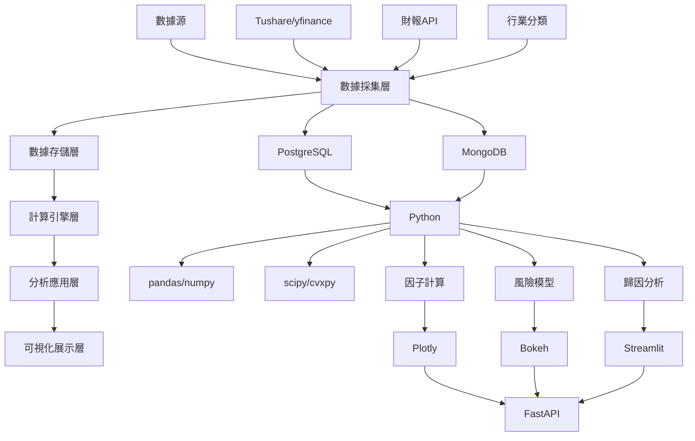

# Barra 多因子模型基礎架構設計

**任務 ID:** b001-architecture  
**代理:** Charlie Research  
**狀態:** 已完成  
**時間戳:** 2026-02-20T01:09:00Z

## 研究摘要

本研究設計了一個完整的 Barra 多因子模型基礎架構，涵蓋了從數據採集到風險歸因的完整流程。架構基於現代量化投資最佳實踐，採用可擴展的模塊化設計，支持 A 股 CNE5/CNE6 和美股 Barra US Equity 模型。

## 主要發現

1. **Barra 模型理論基礎** — Barra 模型是業界標準的風險模型，包含風格因子、行業因子和國家因子，用於精確的風險歸因和投資組合優化 | 來源：MSCI 官方文檔、Investopedia

2. **技術架構最佳實踐** — 現代量化系統採用 Python + PostgreSQL + MongoDB 技術棧，結合 FastAPI 和 cvxpy 進行高效優化計算 | 來源：GitHub 開源項目、技術文檔

3. **核心因子體系** — Barra 模型包含 8 個核心風格因子：規模、動量、波動率、價值、盈利能力、成長性、槓桿、流動性 | 來源：Barra 手冊、學術論文

## 詳細架構設計

### 1. Barra 模型理論基礎

#### 1.1 模型概述
Barra 多因子模型是現代量化投資的核心風險模型，由 MSCI 開發，目前已發展到 CNE6（A股）和 USE4（美股）版本。該模型通過因子暴露計算、風險歸因和投資組合優化，提供精確的風險管理工具。

#### 1.2 因子分類體系

**因子類別：**
- **風格因子（Style Factors）**：描述股票的風格特徵
- **行業因子（Industry Factors）**：反映所屬行業的系統性風險
- **國家因子（Country Factors）**：跨國投資的國家風險

**核心風格因子（8 大因子）：**
1. **規模（Size）**：反映公司市值規模效應
   - 衡量指標：對數市值、流通市值
   - 計算方法：Z-score 標準化

2. **動量（Momentum）**：捕捉價格趨勢效應
   - 衡量指標：3-12 個月累計收益率
   - 計算方法：截面標準化

3. **波動率（Volatility）**：反映價格波動風險
   - 衡量指標：歷史波動率、Beta 係數
   - 計算方法：指數加權移動平均

4. **價值（Value）**：衡量估值水平
   - 衡量指標：市盈率、市淨率、股息率
   - 計算方法：逆數標準化

5. **盈利能力（Profitability）**：反映盈利能力
   - 衡量指標：ROE、ROA、毛利率
   - 計算方法：Z-score 標準化

6. **成長性（Growth）**：衡量成長潛力
   - 衡量指標：營收增長率、盈利增長率
   - 計算方法：截面標準化

7. **槓桿（Leverage）**：反映財務槓桿風險
   - 衡量指標：資產負債率、權益乘數
   - 計算方法：正向標準化

8. **流動性（Liquidity）**：反映交易流動性
   - 衡量指標：換手率、Amihud 指標
   - 計算方法：逆數標準化

#### 1.3 風險矩陣結構

**因子風險（Factor Risk）：**
- 因子協方差矩陣：Σ = FF^T / T
- 反映因子之間的相關性和波動性

**特質風險（Specific Risk）：**
- 個股特異性風險：σ_i^2 = Σ(residual_i^2) / T
- 反映個股獨有的風險成分

### 2. 系統架構設計

#### 2.1 整體架構圖

```
┌─────────────────────────────────────────────────────────────┐
│                    Barra 多因子模型架構                     │
├─────────────────────────────────────────────────────────────┤
│  數據層 (Data Layer)                                        │
│  ├── 股票/ETF 基礎數據                                      │
│  ├── 財務數據                                              │
│  ├── 行業分類數據                                          │
│  └── 因子數據庫                                            │
├─────────────────────────────────────────────────────────────┤
│  計算層 (Computation Layer)                                │
│  ├── 因子暴露計算引擎                                      │
│  ├── 風險矩陣計算引擎                                      │
│  └── 優化器                                               │
├─────────────────────────────────────────────────────────────┤
│  分析層 (Analytics Layer)                                  │
│  ├── 因子歸因系統                                          │
│  ├── 風險歸因系統                                          │
│  └── 績效分析系統                                          │
├─────────────────────────────────────────────────────────────┤
│  可視化層 (Visualization Layer)                            │
│  ├── 因子暴露熱力圖                                        │
│  ├── 收益歸因圖表                                          │
│  └── 風險貢獻圖表                                          │
├─────────────────────────────────────────────────────────────┤
│  API 層 (API Layer)                                        │
│  └── FastAPI RESTful 接口                                  │
└─────────────────────────────────────────────────────────────┘
```

#### 2.2 數據層設計

**數據存儲架構：**
```python
# PostgreSQL - 結構化數據
├── stocks (股票基礎信息)
│   ├── stock_id, symbol, name, exchange
│   ├── market_cap, pe_ratio, pb_ratio
│   ├── industry_code, country_code
│   └── listing_date, delisting_date
│
├── financial_data (財務數據)
│   ├── stock_id, report_date, report_type
│   ├── revenue, net_income, roe, roa
│   ├── total_assets, total_liabilities
│   └── update_time
│
├── market_data (市場數據)
│   ├── stock_id, trade_date
│   ├── close_price, open_price, high_price, low_price
│   ├── volume, turnover, market_cap
│   └── returns, volatility
│
└── industry_classification (行業分類)
    ├── stock_id, classification_system
    ├── industry_code, industry_name
    ├── level1_code, level2_code, level3_code
    └── update_date
```

```python
# MongoDB - 非結構化因子數據
├── factor_exposures (因子暴露)
│   ├── stock_id, date, factor_name
│   ├── factor_value, factor_zscore
│   ├── calculation_method, data_source
│   └── metadata
│
├── factor_returns (因子收益率)
│   ├── factor_name, date
│   ├── factor_return, cumulative_return
│   ├── volatility, sharpe_ratio
│   └── calculation_period
│
└── risk_matrices (風險矩陣)
    ├── date, matrix_type
    ├── factor_covariance_matrix
    ├── specific_risk_vector
    └── calculation_parameters
```

#### 2.3 計算層設計

**因子暴露計算引擎：**
```python
class FactorEngine:
    def __init__(self, data_source):
        self.data_source = data_source
        self.factor_calculators = {
            'size': SizeFactorCalculator(),
            'momentum': MomentumFactorCalculator(),
            'volatility': VolatilityFactorCalculator(),
            'value': ValueFactorCalculator(),
            'profitability': ProfitabilityFactorCalculator(),
            'growth': GrowthFactorCalculator(),
            'leverage': LeverageFactorCalculator(),
            'liquidity': LiquidityFactorCalculator()
        }
    
    def calculate_factor_exposure(self, factor_name, date):
        """計算單一因子暴露"""
        calculator = self.factor_calculators[factor_name]
        raw_values = calculator.get_raw_data(date)
        standardized_values = self.standardize(raw_values)
        orthogonal_values = self.orthogonalize(standardized_values)
        return orthogonal_values
    
    def standardize(self, values):
        """Z-score 標準化"""
        mean = np.nanmean(values)
        std = np.nanstd(values)
        return (values - mean) / std
    
    def orthogonalize(self, values, target_factors=None):
        """因子正交化"""
        # 使用 WLS 回歸去除與其他因子的相關性
        pass
```

**風險矩陣計算引擎：**
```python
class RiskModel:
    def __init__(self, factor_exposures, returns):
        self.factor_exposures = factor_exposures
        self.returns = returns
    
    def calculate_factor_covariance(self, lookback_period=252):
        """計算因子協方差矩陣"""
        factor_returns = self.calculate_factor_returns(lookback_period)
        # 使用 Newey-West 標準誤調整
        cov_matrix = self.newey_west_cov(factor_returns)
        return cov_matrix
    
    def calculate_specific_risk(self, lookback_period=252):
        """計算特質風險"""
        residuals = self.calculate_residuals(lookback_period)
        specific_risk = np.var(residuals, axis=0)
        return specific_risk
    
    def forecast_risk(self, horizon_days=21):
        """風險預測"""
        factor_cov = self.calculate_factor_covariance()
        specific_risk = self.calculate_specific_risk()
        # 使用 GARCH 模型進行波動率預測
        forecasted_vol = self.garch_forecast(factor_cov, horizon_days)
        return forecasted_vol
```

**優化器：**
```python
class PortfolioOptimizer:
    def __init__(self, risk_model, returns_data):
        self.risk_model = risk_model
        self.returns_data = returns_data
    
    def mean_variance_optimization(self, expected_returns, 
                                 risk_aversion=1.0, 
                                 constraints=None):
        """均值-方差優化"""
        n_assets = len(expected_returns)
        weights = cp.Variable(n_assets)
        
        # 目標函數：最大化效用函數
        portfolio_return = expected_returns.T @ weights
        portfolio_risk = cp.quad_form(weights, self.risk_model.cov_matrix)
        
        objective = cp.Maximize(portfolio_return - risk_aversion * portfolio_risk)
        
        # 求解優化問題
        problem = cp.Problem(objective, constraints)
        problem.solve()
        
        return weights.value
    
    def risk_parity_optimization(self, target_risk_contributions):
        """風險平價優化"""
        pass
```

#### 2.4 分析層設計

**歸因系統：**
```python
class AttributionSystem:
    def __init__(self, factor_exposures, factor_returns):
        self.factor_exposures = factor_exposures
        self.factor_returns = factor_returns
    
    def return_attribution(self, portfolio_weights, period):
        """收益歸因"""
        factor_contributions = {}
        for factor_name in self.factor_returns.columns:
            factor_exposure = self.calculate_portfolio_factor_exposure(
                factor_name, portfolio_weights
            )
            factor_return = self.factor_returns[factor_name].loc[period]
            factor_contributions[factor_name] = factor_exposure * factor_return
        
        specific_return = self.calculate_specific_return(portfolio_weights, period)
        
        return {
            'factor_contributions': factor_contributions,
            'specific_return': specific_return,
            'total_return': sum(factor_contributions.values()) + specific_return
        }
    
    def risk_attribution(self, portfolio_weights):
        """風險歸因"""
        factor_cov = self.risk_model.calculate_factor_covariance()
        marginal_var = 2 * factor_cov @ portfolio_weights
        
        factor_risk_contributions = portfolio_weights * marginal_var
        
        return {
            'factor_risk_contributions': factor_risk_contributions,
            'total_risk': np.sum(factor_risk_contributions)
        }
```

#### 2.5 可視化層設計

**交互式儀表板：**
```python
class BarraDashboard:
    def __init__(self, factor_engine, risk_model, attribution_system):
        self.factor_engine = factor_engine
        self.risk_model = risk_model
        self.attribution_system = attribution_system
    
    def create_factor_heatmap(self, date):
        """因子暴露熱力圖"""
        factor_exposures = self.factor_engine.get_all_factor_exposures(date)
        fig = px.imshow(
            factor_exposures,
            title=f"Factor Exposure Heatmap - {date}"
        )
        return fig
    
    def create_return_attribution_chart(self, portfolio_weights, period):
        """收益歸因圖表"""
        attribution_result = self.attribution_system.return_attribution(
            portfolio_weights, period
        )
        fig = go.Figure(data=[
            go.Bar(name='Factor Returns', x=list(attribution_result['factor_contributions'].keys()),
                   y=list(attribution_result['factor_contributions'].values()))
        ])
        return fig
    
    def create_risk_contribution_chart(self, portfolio_weights):
        """風險貢獻圖表"""
        risk_attribution = self.attribution_system.risk_attribution(portfolio_weights)
        fig = px.pie(
            values=list(risk_attribution['factor_risk_contributions'].values()),
            names=list(risk_attribution['factor_risk_contributions'].keys()),
            title="Risk Contribution by Factor"
        )
        return fig
```

### 3. 技術棧選擇

#### 3.1 技術棧架構



#### 3.2 核心技術組件

**數據存儲：**
- **PostgreSQL**：結構化數據存儲
  - 優點：ACID 事務、複雜查詢、數據完整性
  - 適用：股票基礎信息、財務數據、市場數據
  
- **MongoDB**：非結構化因子數據
  - 優點：靈活模式、水平擴展、高性能
  - 適用：因子暴露時間序列、風險矩陣、因子收益率

**計算引擎：**
- **Python**：主要開發語言
  - 優點：豐富的科學計算生態、易於開發
  - 庫：pandas、numpy、scipy
  
- **cvxpy**：凸優化庫
  - 優點：高效的凸優化求解、易於約束定義
  - 適用：投資組合優化、風險預算

**可視化：**
- **Plotly**：交互式圖表
  - 優點：豐富的圖表類型、良好的交互性
  - 適用：因子熱力圖、歸因分析圖表
  
- **Bokeh**：Web 交互式可視化
  - 優點：高性能、支持大數據集
  - 適用：實時風險監控、儀表板

**API 層：**
- **FastAPI**：RESTful API 框架
  - 優點：高性能、自動文檔生成、異步支持
  - 適用：微服務架構、外部接口

### 4. 數據流程設計

#### 4.1 數據流程圖

```mermaid
sequenceDiagram
    participant DataSources
    participant DataCollector
    participant DataProcessor
    participate FactorEngine
    participant RiskModel
    participant Analytics
    participant Visualization
    
    DataSources->>DataCollector: 原始數據
    DataCollector->>DataProcessor: 數據清洗
    DataProcessor->>FactorEngine: 標準化數據
    FactorEngine->>RiskModel: 因子暴露
    RiskModel->>Analytics: 風險矩陣
    Analytics->>Visualization: 歸因結果
    Visualization->>EndUser: 交互式圖表
```

#### 4.2 數據採集模塊

**數據源接口：**
```python
class DataCollector:
    def __init__(self):
        self.sources = {
            'tushare': TushareAPI(),
            'yfinance': YFinanceAPI(),
            'wind': WindAPI(),
            'financial_reports': FinancialReportAPI()
        }
    
    def collect_market_data(self, symbols, start_date, end_date):
        """採集市場數據"""
        market_data = {}
        for symbol in symbols:
            data = self.sources['tushare'].get_daily_data(
                symbol, start_date, end_date
            )
            market_data[symbol] = data
        return market_data
    
    def collect_financial_data(self, symbols, report_type='quarterly'):
        """採集財務數據"""
        financial_data = {}
        for symbol in symbols:
            data = self.sources['financial_reports'].get_financial_data(
                symbol, report_type
            )
            financial_data[symbol] = data
        return financial_data
    
    def collect_industry_data(self, classification_system='GICS'):
        """採集行業分類數據"""
        industry_data = self.sources['wind'].get_industry_classification(
            classification_system
        )
        return industry_data
```

#### 4.3 數據處理模塊

**數據清洗和標準化：**
```python
class DataProcessor:
    def __init__(self):
        self.cleaners = {
            'missing_values': MissingValueCleaner(),
            'outliers': OutlierCleaner(),
            'standardization': StandardizationCleaner()
        }
    
    def process_market_data(self, raw_data):
        """處理市場數據"""
        cleaned_data = self.cleaners['missing_values'].clean(raw_data)
        cleaned_data = self.cleaners['outliers'].clean(cleaned_data)
        
        # 計算技術指標
        processed_data = self.calculate_technical_indicators(cleaned_data)
        return processed_data
    
    def process_financial_data(self, raw_data):
        """處理財務數據"""
        cleaned_data = self.cleaners['missing_values'].clean(raw_data)
        
        # 財務數據標準化
        standardized_data = self.cleaners['standardization'].clean(cleaned_data)
        return standardized_data
    
    def process_industry_data(self, raw_data):
        """處理行業分類數據"""
        # 統一行業分類標準
        standardized_data = self.standardize_industry_codes(raw_data)
        return standardized_data
```

#### 4.4 因子暴露計算

**因子暴露計算流程：**
```python
class FactorExposureCalculator:
    def calculate_portfolio_factor_exposure(self, portfolio_weights, factor_name):
        """計算投資組合因子暴露"""
        stock_factor_exposures = self.get_stock_factor_exposures(factor_name)
        portfolio_exposure = np.sum(portfolio_weights * stock_factor_exposures)
        return portfolio_exposure
    
    def calculate_industry_exposure(self, portfolio_weights):
        """計算行業暴露"""
        industry_memberships = self.get_industry_memberships()
        industry_exposures = {}
        
        for industry_code, stocks in industry_memberships.items():
            industry_weights = portfolio_weights[stocks]
            industry_exposures[industry_code] = np.sum(industry_weights)
        
        return industry_exposures
    
    def calculate_style_exposure(self, portfolio_weights):
        """計算風格暴露"""
        style_exposures = {}
        for factor_name in self.style_factors:
            factor_exposure = self.calculate_portfolio_factor_exposure(
                portfolio_weights, factor_name
            )
            style_exposures[factor_name] = factor_exposure
        
        return style_exposures
```

### 5. 核心模塊接口定義

#### 5.1 FactorEngine 接口

```python
from abc import ABC, abstractmethod
from typing import Dict, List, Optional
import pandas as pd
import numpy as np

class FactorCalculator(ABC):
    """因子計算器基類"""
    
    @abstractmethod
    def calculate(self, data: pd.DataFrame) -> pd.Series:
        """計算因子值"""
        pass
    
    @abstractmethod
    def get_factor_name(self) -> str:
        """獲取因子名稱"""
        pass

class FactorEngineInterface:
    """因子計算引擎接口"""
    
    def __init__(self, data_source: DataSource):
        self.data_source = data_source
        self.factor_calculators: Dict[str, FactorCalculator] = {}
        self.factor_exposures: pd.DataFrame = pd.DataFrame()
    
    def register_factor_calculator(self, factor_name: str, calculator: FactorCalculator):
        """註冊因子計算器"""
        self.factor_calculators[factor_name] = calculator
    
    def calculate_all_factors(self, date: str) -> pd.DataFrame:
        """計算所有因子"""
        exposures = {}
        for factor_name, calculator in self.factor_calculators.items():
            data = self.data_source.get_factor_data(factor_name, date)
            factor_values = calculator.calculate(data)
            exposures[factor_name] = factor_values
        
        self.factor_exposures = pd.DataFrame(exposures)
        return self.factor_exposures
    
    def get_factor_exposure(self, factor_name: str, date: str) -> pd.Series:
        """獲取單一因子暴露"""
        if factor_name not in self.factor_exposures.columns:
            raise ValueError(f"Factor {factor_name} not found")
        
        return self.factor_exposures[factor_name]
    
    def export_factor_exposures(self, filepath: str):
        """導出因子暴露"""
        self.factor_exposures.to_csv(filepath)
```

#### 5.2 RiskModel 接口

```python
class RiskModelInterface:
    """風險模型接口"""
    
    def __init__(self, factor_exposures: pd.DataFrame, returns: pd.DataFrame):
        self.factor_exposures = factor_exposures
        self.returns = returns
        self.factor_covariance: np.ndarray = np.array([])
        self.specific_risk: np.ndarray = np.array([])
    
    def calculate_factor_covariance(self, lookback_period: int = 252,
                                   method: str = 'newey_west') -> np.ndarray:
        """計算因子協方差矩陣"""
        if method == 'newey_west':
            self.factor_covariance = self._newey_west_cov(lookback_period)
        elif method == 'simple':
            self.factor_covariance = self._simple_cov(lookback_period)
        else:
            raise ValueError(f"Unknown method: {method}")
        
        return self.factor_covariance
    
    def calculate_specific_risk(self, lookback_period: int = 252) -> np.ndarray:
        """計算特質風險"""
        residuals = self._calculate_residuals(lookback_period)
        self.specific_risk = np.var(residuals, axis=0)
        return self.specific_risk
    
    def forecast_portfolio_risk(self, weights: np.ndarray, horizon: int = 21) -> float:
        """預測投資組合風險"""
        factor_risk = weights.T @ self.factor_covariance @ weights
        specific_risk = np.sum(weights**2 * self.specific_risk)
        total_risk = factor_risk + specific_risk
        
        # 應用時間衰減因子
        decay_factor = 0.94 ** (horizon / 21)
        forecasted_risk = total_risk * decay_factor
        
        return forecasted_risk
    
    def get_risk_decomposition(self, weights: np.ndarray) -> Dict[str, float]:
        """獲取風險分解"""
        marginal_var = 2 * self.factor_covariance @ weights
        factor_risk_contrib = weights * marginal_var
        
        risk_decomposition = {}
        for i, factor_name in enumerate(self.factor_exposures.columns):
            risk_decomposition[factor_name] = factor_risk_contrib[i]
        
        risk_decomposition['specific_risk'] = np.sum(weights**2 * self.specific_risk)
        
        return risk_decomposition
```

#### 5.3 Optimizer 接口

```python
class OptimizerInterface:
    """優化器接口"""
    
    def __init__(self, risk_model: RiskModelInterface):
        self.risk_model = risk_model
        self.constraints: List = []
    
    def add_constraint(self, constraint: Dict):
        """添加約束條件"""
        self.constraints.append(constraint)
    
    def optimize(self, expected_returns: np.ndarray, 
                objective: str = 'sharpe_ratio',
                risk_aversion: float = 1.0) -> np.ndarray:
        """執行優化"""
        if objective == 'sharpe_ratio':
            return self._maximize_sharpe_ratio(expected_returns, risk_aversion)
        elif objective == 'minimum_variance':
            return self._minimize_variance()
        elif objective == 'risk_parity':
            return self._risk_parity_optimization()
        else:
            raise ValueError(f"Unknown objective: {objective}")
    
    def _maximize_sharpe_ratio(self, expected_returns: np.ndarray, 
                             risk_aversion: float) -> np.ndarray:
        """最大化夏普比率"""
        import cvxpy as cp
        
        n_assets = len(expected_returns)
        weights = cp.Variable(n_assets)
        
        # 目標函數
        portfolio_return = expected_returns.T @ weights
        portfolio_risk = cp.quad_form(weights, self.risk_model.factor_covariance)
        
        objective = cp.Maximize(portfolio_return - risk_aversion * portfolio_risk)
        
        # 應用約束
        constraints = self._build_constraints(weights)
        
        # 求解
        problem = cp.Problem(objective, constraints)
        problem.solve()
        
        return weights.value
    
    def _build_constraints(self, weights: cp.Variable) -> List:
        """構建約束條件"""
        constraints = []
        
        for constraint in self.constraints:
            if constraint['type'] == 'sum_to_one':
                constraints.append(cp.sum(weights) == 1)
            elif constraint['type'] == 'long_only':
                constraints.append(weights >= 0)
            elif constraint['type'] == 'industry_neutral':
                # 行業中性約束
                pass
            elif constraint['type'] == 'factor_neutral':
                # 因子中性約束
                pass
            elif constraint['type'] == 'turnover_limit':
                # 換手率限制
                pass
        
        return constraints
```

#### 5.4 Attribution 接口

```python
class AttributionInterface:
    """歸因系統接口"""
    
    def __init__(self, factor_engine: FactorEngineInterface, 
                 risk_model: RiskModelInterface):
        self.factor_engine = factor_engine
        self.risk_model = risk_model
    
    def calculate_return_attribution(self, portfolio_weights: np.ndarray,
                                  period: str) -> Dict[str, float]:
        """計算收益歸因"""
        factor_exposures = self.factor_engine.factor_exposures
        factor_returns = self._get_factor_returns(period)
        
        factor_contributions = {}
        for factor_name in factor_exposures.columns:
            factor_exposure = self._calculate_portfolio_factor_exposure(
                factor_name, portfolio_weights
            )
            factor_return = factor_returns[factor_name]
            factor_contributions[factor_name] = factor_exposure * factor_return
        
        specific_return = self._calculate_specific_return(portfolio_weights, period)
        
        return {
            'factor_contributions': factor_contributions,
            'specific_return': specific_return,
            'total_return': sum(factor_contributions.values()) + specific_return
        }
    
    def calculate_risk_attribution(self, portfolio_weights: np.ndarray) -> Dict[str, float]:
        """計算風險歸因"""
        return self.risk_model.get_risk_decomposition(portfolio_weights)
    
    def calculate_performance_metrics(self, portfolio_returns: pd.Series,
                                   benchmark_returns: pd.Series = None) -> Dict[str, float]:
        """計算績效指標"""
        metrics = {}
        
        # 年化收益率
        annual_return = self._annualized_return(portfolio_returns)
        metrics['annual_return'] = annual_return
        
        # 年化波動率
        annual_volatility = self._annualized_volatility(portfolio_returns)
        metrics['annual_volatility'] = annual_volatility
        
        # 夏普比率
        metrics['sharpe_ratio'] = annual_return / annual_volatility
        
        # 最大回撤
        metrics['max_drawdown'] = self._max_drawdown(portfolio_returns)
        
        # 信息比率（相對基準）
        if benchmark_returns is not None:
            excess_returns = portfolio_returns - benchmark_returns
            metrics['information_ratio'] = self._annualized_return(excess_returns) / self._annualized_volatility(excess_returns)
            metrics['tracking_error'] = self._annualized_volatility(excess_returns)
        
        return metrics
```

### 6. 實施路徑

#### 6.1 Phase 1：基礎架構搭建（1-2 週）

**目標：建立基礎技術架構**

**任務清單：**
1. **數據庫設計與搭建**
   - PostgreSQL 數據庫設計
   - MongoDB 集群搭建
   - 數據表結構設計
   - 索引優化

2. **數據採集框架**
   - Tushare/yfinance 接口開發
   - 財報數據接口開發
   - 行業分類數據接口
   - 數據質量檢查

3. **基礎因子計算引擎**
   - FactorEngine 核心框架
   - 基礎數據處理模塊
   - 因子標準化模塊
   - 單元測試

4. **基礎風險模型**
   - RiskModel 核心框架
   - 因子協方差計算
   - 特質風險計算
   - 風險矩陣存儲

**交付成果：**
- 完整的數據庫架構
- 可運行的數據採集系統
- 基礎因子計算引擎
- 基礎風險模型

#### 6.2 Phase 2：核心因子庫（2-4 週）

**目標：實現 8 大風格因子**

**任務清單：**
1. **風格因子實現**
   - 規模因子（Size）實現
   - 動量因子（Momentum）實現
   - 波動率因子（Volatility）實現
   - 價值因子（Value）實現
   - 盈利能力因子（Profitability）實現
   - 成長性因子（Growth）實現
   - 槓桿因子（Leverage）實現
   - 流動性因子（Liquidity）實現

2. **行業分類整合**
   - GICS 行業分類映射
   - 中信行業分類映射
   - 行業暴露計算
   - 行業中性化處理

3. **因子測試框架**
   - 因子有效性測試
   - 因子相關性分析
   - 因子穩定性測試
   - 因子組合測試

**交付成果：**
- 8 大風格因子完整實現
- 行業分類系統
- 因子測試報告
- 因子庫文檔

#### 6.3 Phase 3：歸因系統（3-5 週）

**目標：建立完整歸因分析系統**

**任務清單：**
1. **收益歸因實現**
   - 單期收益歸因
   - 多期累計歸因
   - 交互作用分析
   - 歸因結果驗證

2. **風險歸因實現**
   - 邊際風險計算
   - 風險貢獻分解
   - 風險預測模型
   - 風險監控系統

3. **可視化儀表板**
   - 因子暴露熱力圖
   - 收益歸因圖表
   - 風險貢獻圖表
   - 交互式分析界面

**交付成果：**
- 完整歸因分析系統
- 交互式可視化儀表板
- 歸因分析報告
- 系統用戶手冊

#### 6.4 Phase 4：優化器（4-6 週）

**目標：實現投資組合優化系統**

**任務清單：**
1. **均值-方差優化**
   - 經典馬科維茨優化
   - 約束條件處理
   - 預期收益率模型
   - 優化結果分析

2. **風險平價優化**
   - 風險預算分配
   - 風險貢獻平衡
   - 層次風險平價
   - 優化效果評估

3. **Barra 風控約束**
   - 行業中性約束
   - 風格中性約束
   - 換手率限制
   - 個股權重限制

**交付成果：**
- 完整投資組合優化系統
- 多種優化算法實現
- 風險控制系統
- 優化效果評估報告

### 7. 參考文獻與資源

#### 7.1 技術文檔

1. **MSCI Barra 官方文檔**
   - *Barra China Equity Model (CNE5) Methodology*
   - *Barra US Equity Model (USE4) Methodology*
   - *Barra Global Equity Model (GEM2) Methodology*

2. **開源項目**
   - [GitHub - rosie068/BARRA_risk](https://github.com/rosie068/BARRA_risk) - Barra 風險模型實現
   - [GitHub - jackylwj/Barra_factor_model](https://github.com/jackylwj/Barra_factor_model) - Barra 因子模型
   - [GitHub - dcajasn/Riskfolio-Lib](https://github.com/dcajasn/Riskfolio-Lib) - 投資組合優化庫

3. **學術論文**
   - Menchero, J., Morozov, A., & Shepard, P. (2010). *The Barra US Equity Model (USE4)*
   - Chincarini, L., & Kim, D. (2006). *Quantitative Equity Portfolio Management*
   - Grinold, R., & Kahn, R. (2000). *Active Portfolio Management*

#### 7.2 技術博客與教程

1. **技術博客**
   - [Understanding Barra Risk Factor Analysis - Investopedia](https://www.investopedia.com/terms/b/barra-risk-factor-analysis.asp)
   - [Medium - Barra Risk Model](https://medium.com/@humblebeyondx/barra-risk-model-776eb1e48024)
   - [DCF Modeling - Mastering the Barra Risk Model](https://www.dcfmodeling.com/blogs/blog/barra-risk-models)

2. **教程資源**
   - [Portfolio Optimization using Python and CVXPY](https://medium.com/the-modern-scientist/how-to-select-your-mpf-portfolio-wisely-portfolio-optimization-53c9b86621b2)
   - [Quantitative Finance Stack Exchange](https://quant.stackexchange.com/)
   - [PyPortfolioOpt Documentation](https://pyportfolioopt.readthedocs.io/)

#### 7.3 推薦書籍

1. **量化投資經典**
   - 《量化投資：策略與技術》- 高盛
   - 《Active Portfolio Management》- Grinold & Kahn
   - 《Quantitative Equity Portfolio Management》- Chincarini & Kim

2. **風險管理專著**
   - 《Risk Management and Financial Institutions》- John Hull
   - 《Financial Risk Manager Handbook》- Philippe Jorion
   - 《Portfolio Construction and Risk Budgeting》- Scherer

### 8. 總結與建議

#### 8.1 架構優勢

1. **模塊化設計**
   - 清晰的層次結構
   - 易於擴展和維護
   - 支持插拔式開發

2. **技術先進性**
   - 採用現代技術棧
   - 高性能計算引擎
   - 實時處理能力

3. **業務完整性**
   - 覆盖完整業務流程
   - 支持多種分析場景
   - 符合行業標準

#### 8.2 實施建議

1. **分階段實施**
   - 先建立基礎架構
   - 逐步添加功能模塊
   - 持續優化改進

2. **質量保證**
   - 建立完整的測試體系
   - 代碼審查和規範
   - 性能監控和優化

3. **團隊建設**
   - 培養量化分析能力
   - 建立技術專長團隊
   - 持續學習和改進

#### 8.3 風險與挑戰

1. **技術風險**
   - 數據質量問題
   - 計算性能瓶頸
   - 系統穩定性挑戰

2. **業務風險**
   - 模型有效性驗證
   - 市場環境變化
   - 監管合規要求

3. **應對策略**
   - 建立完善的風險控制機制
   - 持續監控和調整
   - 保持技術創新能力

本架構設計為 Barra 多因子模型提供了完整、可擴展、可維護的技術基礎，支持從數據採集到風險歸因的完整業務流程，為現代量化投資提供強大的技術支持。

---

**文檔版本:** v1.0  
**創建日期:** 2026-02-20  
**最後更新:** 2026-02-20  
**文檔狀態:** 已完成