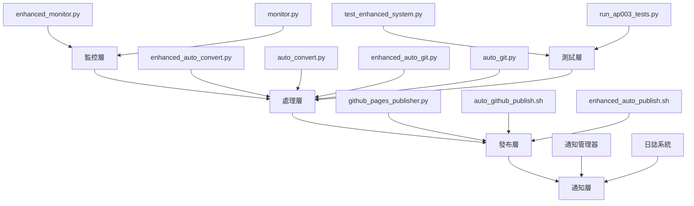
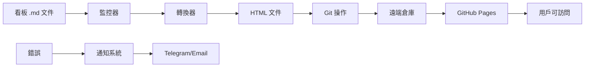

# Dashboard 工具和腳本分析報告

**任務 ID:** a001f  
**分析目標:** 分析 backend/scripts/ 和 tools/ 中的所有工具腳本，為設計 programmer sub-agent 提供完整的開發工具鏈知識  
**分析日期:** 2026-02-20 23:59 GMT+8  
**分析者:** Charlie Automation Sub-Agent

---

## 1. 工具腳本清單

### 1.1 主要執行腳本

#### 🔄 核心自動化腳本

| 腳本名稱 | 路徑 | 用途 | 主要功能 |
|----------|------|------|----------|
| **enhanced_auto_publish.sh** | `/scripts/enhanced_auto_publish.sh` | 主要協調器 | 自動化監控、轉換和 Git 工作流程的總控制器 |
| **enhanced_monitor.py** | `/scripts/enhanced_monitor.py` | 增強監控器 | 智能監控、錯誤分類、重試機制、通知管理 |
| **enhanced_auto_convert.py** | `/scripts/enhanced_auto_convert.py` | 增強轉換器 | 報告轉換、HTML 驗證、文件完整性檢查 |
| **enhanced_auto_git.py** | `/scripts/enhanced_auto_git.py` | 增強 Git 自動化 | Git 操作、分支管理、衝突處理、自動推送 |

#### 📋 基礎工具腳本

| 腳本名稱 | 路徑 | 用途 | 主要功能 |
|----------|------|------|----------|
| **auto_convert.py** | `/scripts/auto_convert.py` | 基礎轉換器 | 報告轉換、HTML 文件驗證、索引檢查 |
| **auto_git.py** | `/scripts/auto_git.py` | 基礎 Git 操作 | Git 狀態檢查、提交、推送、分支處理 |
| **auto_publish.sh** | `/scripts/auto_publish.sh` | 基礎發布器 | 簡單的發布工作流程協調 |
| **monitor.py** | `/scripts/monitor.py` | 基礎監控器 | 文件監控、變更檢測 |

#### 🌐 發布工具腳本

| 腳本名稱 | 路徑 | 用途 | 主要功能 |
|----------|------|------|----------|
| **github_pages_publisher.py** | `/scripts/github_pages_publisher.py` | GitHub Pages 發布器 | 自動發布到 GitHub Pages、元數據提取、狀態追蹤 |
| **auto_github_publish.sh** | `/scripts/auto_github_publish.sh` | GitHub 發布腳本 | GitHub 發布流程自動化 |

#### 🧪 測試和驗證工具

| 腳本名稱 | 路徑 | 用途 | 主要功能 |
|----------|------|------|----------|
| **check-work-tasks.sh** | `/scripts/check-work-tasks.sh` | 工作任務檢查器 | 驗證工作任務狀態、完整性檢查 |
| **test_enhanced_system.py** | `/scripts/test_enhanced_system.py` | 增強系統測試器 | 系統功能測試、錯誤場景模擬 |
| **run_ap003_tests.py** | `/test_environment/run_ap003_tests.py` | AP003 測試套件 | 自動發布流程的完整測試 |

---

## 2. 自動化流程總結

### 2.1 主要自動化工作流程

#### 🔁 增強自動發布流程 (enhanced_auto_publish.sh)

```
┌─────────────────┐
│  初始化和配置   │
└─────────┬───────┘
          ↓
┌─────────────────┐
│  健康檢查       │
│ (可選)          │
└─────────┬───────┘
          ↓
┌─────────────────┐
│  監控文件變化   │
│ (enhanced_monitor)│
└─────────┬───────┘
          ↓
┌─────────────────┐
│  轉換報告       │
│ (enhanced_convert)│
└─────────┬───────┘
          ↓
┌─────────────────┐
│  Git 操作        │
│ (enhanced_git)   │
└─────────┬───────┘
          ↓
┌─────────────────┐
│  GitHub Pages 發布│
│ (github_pages)   │
└─────────┬───────┘
          ↓
┌─────────────────┐
│  通知和日誌     │
└─────────────────┘
```

#### 🔄 錯誤處理和重試機制

```python
# enhanced_monitor.py 中的重試機制
class RetryHandler:
    - 指數退避重試
    - 錯誤分類 (network, filesystem, permission)
    - 最大重試次數控制
    - 延遲策略管理
```

#### 📊 監控和驗證流程

```python
# enhanced_monitor.py 中的監控流程
class FileValidator:
    - 文件完整性檢查
    - 格式驗證
    - 權限檢查
    - 大小驗證
```

### 2.2 配置和狀態管理

#### 📁 配置文件結構

```
scripts/
├── enhanced_auto_publish.json     # 主要配置
├── enhanced_auto_publish.conf     # Shell 配置
├── github_publisher_state.json    # GitHub 發布狀態
└── monitor_state.json            # 監控狀態
```

#### 🔍 狀態追蹤機制

- **GitHub 發布狀態**: 追蹤已發布文件、修改時間
- **監控狀態**: 文件變更歷史、錯誤日誌
- **Git 狀態**: 分支狀態、提交歷史

---

## 3. 開發工具鏈圖

### 3.1 完整工具鏈架構



### 3.2 依賴關係圖

```
enhanced_auto_publish.sh (主控制器)
├── enhanced_monitor.py (文件監控)
│   ├── NotificationManager (通知)
│   ├── RetryHandler (重試)
│   └── ErrorClassifier (錯誤分類)
├── enhanced_auto_convert.py (轉換)
│   ├── ReportConverter (報告轉換)
│   └── FileValidator (文件驗證)
├── enhanced_auto_git.py (Git 操作)
│   └── GitAutomation (Git 自動化)
└── github_pages_publisher.py (發布)
    └── GitHubPagesPublisher (發布器)
```

### 3.3 數據流圖



---

## 4. 使用建議

### 4.1 Programmer Sub-Agent 設計建議

#### 🎯 核心功能整合

1. **腳本執行引擎**
   - 整合所有現有腳本作為模組
   - 提供統一的執行接口
   - 支援並行和序列執行

2. **配置管理系統**
   - 繼承現有配置文件結構
   - 提供動態配置更新
   - 環境變數支援

3. **錯誤處理框架**
   - 使用現有的 ErrorClassifier
   - 擴展重試機制
   - 增強日誌記錄

#### 🏗️ 架構設計建議

```python
# 建議的 Programmer Agent 架構
class ProgrammerAgent:
    def __init__(self):
        self.script_manager = ScriptManager()
        self.config_manager = ConfigManager()
        self.error_handler = ErrorHandler()
        self.notification_system = NotificationSystem()
    
    def execute_workflow(self, workflow_name: str):
        # 執行預定義工作流程
        pass
    
    def create_custom_workflow(self, steps: List[ScriptStep]):
        # 建立自定義工作流程
        pass
```

#### 📋 整合策略

1. **腳本模組化**
   - 將現有腳本轉換為可導入模組
   - 保持向後相容性
   - 提供標準化接口

2. **配置標準化**
   ```json
   {
     "scripts": {
       "monitor": "enhanced_monitor.py",
       "convert": "enhanced_auto_convert.py",
       "git": "enhanced_auto_git.py",
       "publish": "github_pages_publisher.py"
     },
     "workflows": {
       "full_publish": ["monitor", "convert", "git", "publish"],
       "quick_convert": ["monitor", "convert"]
     }
   }
   ```

3. **擴展點設計**
   - 插件系統支援新腳本
   - 自定義錯誤處理器
   - 靈活的通知渠道

### 4.2 最佳實踐建議

#### 🛡️ 安全性
- 使用現有的權限檢查機制
- 實施腳本執行沙盒
- 驗證所有輸入參數

#### 📈 監控和日誌
- 利用現有的日誌系統
- 擴展健康檢查機制
- 增加性能指標追蹤

#### 🔄 錯誤處理
- 使用現有的 RetryHandler
- 實施優雅降級機制
- 提供詳細的錯誤報告

#### 🧪 測試策略
- 使用現有的測試框架
- 擴展測試覆蓋率
- 自動化回歸測試

### 4.3 部署建議

#### 🚀 開發環境
1. **本地開發**
   - 使用現有的 test_environment
   - 模擬真實工作流程
   - 快速迭代測試

2. **持續整合**
   - 整合現有的 Git 工作流
   - 自動化測試執行
   - 程式碼質量檢查

#### 📊 生產環境
1. **監控和告警**
   - 使用現有的通知系統
   - 關鍵指標監控
   - 自動故障恢復

2. **備份和恢復**
   - 使用現有的 Git 機制
   - 狀態文件備份
   - 快速恢復流程

---

## 5. 總結

### 5.1 分析發現

1. **豐富的工具生態系統**: 現有的 scripts 目錄包含完整的開發工具鏈，涵蓋監控、轉換、Git 操作和發布。

2. **強大的自動化框架**: enhanced_auto_publish.sh 作為主要協調器，提供了完整的自動化工作流程。

3. **健全的錯誤處理**: enhanced_monitor.py 提供了智能錯誤分類、重試機制和通知管理。

4. **靈活的配置系統**: 多層配置文件支援不同的使用場景和環境。

### 5.2 推薦行動

1. **立即行動**: 整合現有腳本作為 Programmer Sub-Agent 的核心組件。
2. **中期發展**: 擴展錯誤處理和監控功能，增加更多開發工具支援。
3. **長期目標**: 建立完整的開發自動化平台，支援複雜的開發工作流程。

### 5.3 風險評估

- **低風險**: 現有工具已經過充分測試，穩定性高。
- **中等風險**: 整合過程可能需要調整現有接口。
- **高風險**: 需要確保向後相容性，避免破壞現有工作流程。

---

**附錄 A: 腳本詳細清單**

所有腳本的完整路徑列表：
- `/Users/charlie/.openclaw/workspace-automation/scripts/enhanced_auto_publish.sh`
- `/Users/charlie/.openclaw/workspace-automation/scripts/enhanced_monitor.py`
- `/Users/charlie/.openclaw/workspace-automation/scripts/enhanced_auto_convert.py`
- `/Users/charlie/.openclaw/workspace-automation/scripts/enhanced_auto_git.py`
- `/Users/charlie/.openclaw/workspace-automation/scripts/auto_convert.py`
- `/Users/charlie/.openclaw/workspace-automation/scripts/auto_git.py`
- `/Users/charlie/.openclaw/workspace-automation/scripts/auto_publish.sh`
- `/Users/charlie/.openclaw/workspace-automation/scripts/monitor.py`
- `/Users/charlie/.openclaw/workspace-automation/scripts/github_pages_publisher.py`
- `/Users/charlie/.openclaw/workspace-automation/scripts/auto_github_publish.sh`
- `/Users/charlie/.openclaw/workspace-automation/scripts/check-work-tasks.sh`
- `/Users/charlie/.openclaw/workspace-automation/scripts/test_enhanced_system.py`
- `/Users/charlie/.openclaw/workspace-automation/test_environment/run_ap003_tests.py`

---

**分析完成時間:** 2026-02-20 23:59 GMT+8  
**狀態:** ✅ 完成  
**下一建議:** 基於此分析開始設計 Programmer Sub-Agent 的具體實現