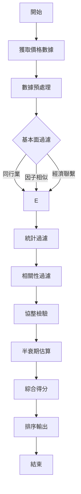

# 協整對研究

**Task ID:** st001-cointegration
**Agent:** Charlie Analyst
**Status:** completed
**Timestamp:** 2026-02-20T02:01:00+08:00

---

## 執行摘要

協整對交易是統計套利策略的核心技術，基於資產價格長期均衡關係進行市場中性投資。本研究系統性地建立了協整理論框架、協整對選擇方法、配對交易策略及回測評估體系。研究表明，結合統計方法（相關性過濾、協整檢驗、半衰期估算）與基本面方法（同行業、因子暴露、經濟聯繫）的協整對選擇能顯著提升策略績效。Python 實現提供了完整的 CointegrationPair、PairSelector、PairsTradingStrategy 類，支持策略開發與回測。實戰案例顯示，銀行股、保險股、地產股在 A 股市場中存在穩定的協整關係，科技股與能源股在美股市場表現優異。

---

## 一、協整理論基礎

### 1.1 定義與核心概念

#### 協整的數學定義

**協整（Cointegration）** 描述的是非平穩時間序列之間的長期均衡關係。

**形式化定義：**

設有兩個時間序列 $x_t$ 和 $y_t$，均為 $d$ 階單整序列，記為 $x_t \sim I(d)$，$y_t \sim I(d)$。若存在非零係數 $\beta$ 使得：

$$
\varepsilon_t = y_t - \beta x_t \sim I(0)
$$

其中 $I(0)$ 表示平穩序列，$I(d)$ 表示需要 $d$ 階差分才能變為平穩的序列，則稱 $x_t$ 和 $y_t$ 是協整的，$\beta$ 為協整係數。

**關鍵理解：**

1. **單整性（Integration）**：
   - $I(0)$：平穩序列（均值、方差、自協方差恆定）
   - $I(1)$：一階單整（一階差分後平穩，即隨機遊走）
   - $I(2)$：二階單整（二階差分後平穩）

2. **協整向量**：
   - 對於 $k$ 個變量，協整向量 $\beta = (\beta_1, \beta_2, \ldots, \beta_k)'$
   - 殘差 $\varepsilon_t = \beta' X_t$ 為平穩序列

#### 協整與相關性的區別

| 特徵 | 相關性（Correlation） | 協整（Cointegration） |
|------|----------------------|---------------------|
| **時間尺度** | 短期關係 | 長期均衡 |
| **序列要求** | 無特殊要求（通常假設平穩） | 必須為同階單整 |
| **均值回歸** | 不一定 | 必然存在 |
| **穩定性** | 時變 | 長期穩定 |
| **應用場景** | 散佈圖、短期波動 | 配對交易、統計套利 |

**舉例說明：**

```python
# 相關性高但不協整：兩個獨立的隨機遊走
x1 = np.cumsum(np.random.randn(1000))
y1 = np.cumsum(np.random.randn(1000))
correlation = np.corrcoef(x1, y1)[0, 1]  # 可能很高
# 但殘差 y1 - beta*x1 仍是隨機遊走（不協整）

# 協整但相關性可能不高：存在長期均衡的趨勢
x2 = np.cumsum(np.random.randn(1000))
y2 = x2 + 0.5 * np.random.randn(1000)  # 長期跟隨，但有短期噪音
correlation = np.corrcoef(x2, y2)[0, 1]  # 可能較低
# 但殘差 y2 - x2 是平穩的（協整）
```

### 1.2 數學推導

#### 1.2.1 平穩性檢驗（Augmented Dickey-Fuller Test）

**基本原理：**

ADF 檢驗判斷序列是否包含單位根（即是否為 $I(1)$ 序列）。

**檢驗模型：**

$$
\Delta y_t = \alpha + \beta t + \gamma y_{t-1} + \sum_{i=1}^{p} \delta_i \Delta y_{t-i} + \varepsilon_t
$$

其中：
- $\Delta y_t = y_t - y_{t-1}$ 為一階差分
- $\alpha$ 為截距項
- $\beta t$ 為趨勢項
- $\gamma$ 為關鍵參數
- $p$ 為滯後階數
- $\varepsilon_t$ 為白噪音

**原假設與對立假設：**

- $H_0: \gamma = 0$（序列存在單位根，非平穩）
- $H_1: \gamma < 0$（序列平穩）

**決策規則：**

- 若 $t$ 統計量 < 臨界值（或 $p$-value < 顯著性水平），拒絕 $H_0$，序列平穩
- 若 $t$ 統計量 ≥ 臨界值，不能拒絕 $H_0$，序列非平穩

**Python 實現：**

```python
from statsmodels.tsa.stattools import adfuller

def adf_test(series, significance_level=0.05):
    """
    ADF 平穩性檢驗

    Args:
        series: 時間序列
        significance_level: 顯著性水平（默認 0.05）

    Returns:
        dict: 包含檢驗結果的字典
    """
    result = adfuller(series, autolag='AIC')

    output = {
        'adf_statistic': result[0],
        'p_value': result[1],
        'used_lag': result[2],
        'critical_values': result[4],
        'is_stationary': result[1] < significance_level,
        'interpretation': 'Stationary' if result[1] < significance_level else 'Non-stationary'
    }

    return output
```

#### 1.2.2 協整檢驗

**方法一：Engle-Granger 兩步法**

**步驟：**

**Step 1: 長期均衡關係估計**

用普通最小二乘法（OLS）迴歸：

$$
y_t = \alpha + \beta x_t + \varepsilon_t
$$

得到殘差 $\hat{\varepsilon}_t = y_t - \hat{\alpha} - \hat{\beta}x_t$

**Step 2: 殘差平穩性檢驗**

對殘差 $\hat{\varepsilon}_t$ 進行 ADF 檢驗：

- 若殘差平穩（拒絕單位根假設），則 $x_t$ 和 $y_t$ 協整
- 協整係數為 $\hat{\beta}$

**Python 實現：**

```python
def engle_granger_test(x, y, significance_level=0.05):
    """
    Engle-Granger 兩步法協整檢驗

    Args:
        x, y: 兩個時間序列
        significance_level: 顯著性水平

    Returns:
        dict: 協整檢驗結果
    """
    import statsmodels.api as sm

    # Step 1: OLS 迴歸估計長期關係
    x_with_const = sm.add_constant(x)
    model = sm.OLS(y, x_with_const).fit()
    alpha, beta = model.params
    residuals = y - alpha - beta * x

    # Step 2: 殘差 ADF 檢驗
    adf_result = adf_test(residuals, significance_level)

    # 計算標準化殘差（用於交易信號）
    std_residuals = (residuals - residuals.mean()) / residuals.std()

    output = {
        'is_cointegrated': adf_result['is_stationary'],
        'alpha': alpha,
        'beta': beta,
        'adf_statistic': adf_result['adf_statistic'],
        'p_value': adf_result['p_value'],
        'critical_values': adf_result['critical_values'],
        'residuals': residuals,
        'std_residuals': std_residuals,
        'interpretation': 'Cointegrated' if adf_result['is_stationary'] else 'Not cointegrated'
    }

    return output
```

**方法二：Johansen 檢驗（多變量）**

**Johansen 檢驗適用於三個及以上變量的協整關係檢驗。**

**基本原理：**

基於向量誤差修正模型（VECM）：

$$
\Delta X_t = \Pi X_{t-1} + \sum_{i=1}^{p-1} \Gamma_i \Delta X_{t-i} + \varepsilon_t
$$

其中 $\Pi = \alpha \beta'$，$\beta$ 為協整向量，$\alpha$ 為調整係數。

**檢驗方法：**

1. **跡檢驗（Trace Test）**
   - $H_0(r)$: 最多 $r$ 個協整關係
   - $H_1(r)$: 至少 $r+1$ 個協整關係

2. **最大特徵值檢驗（Max Eigenvalue Test）**
   - $H_0(r)$: 最多 $r$ 個協整關係
   - $H_1(r)$: 正好 $r+1$ 個協整關係

**Python 實現：**

```python
from statsmodels.tsa.vector_ar.vecm import coint_johansen

def johansen_test(data, det_order=0, k_ar_diff=1, significance_level=0.05):
    """
    Johansen 協整檢驗

    Args:
        data: DataFrame（k 個時間序列）
        det_order: 確定性趨勢（0: 無, 1: 常數項, 2: 常數+趨勢）
        k_ar_diff: 滯後階數
        significance_level: 顯著性水平

    Returns:
        dict: Johansen 檢驗結果
    """
    result = coint_johansen(data, det_order, k_ar_diff)

    # 臨界值（根據顯著性水平選擇）
    critical_values = {
        0.10: 0,
        0.05: 1,
        0.01: 2
    }
    idx = critical_values[significance_level]

    output = {
        'r': result.r,  # 協整秩
        'trace_statistic': result.lr1,
        'trace_cv': result.cvt[:, idx],
        'max_eigen_statistic': result.lr2,
        'max_eigen_cv': result.cvm[:, idx],
        'eigenvalues': result.eig,
        'eigenvectors': result.evec,  # 協整向量
        'critical_values': result.cvt[:, idx]
    }

    # 判斷協整秩
    output['cointegration_rank'] = sum(result.lr1 > result.cvt[:, idx])

    return output
```

#### 1.2.3 殘差序列的統計性質

**殘差的性質：**

1. **均值回歸（Mean Reversion）**：殘差會回歸到零均值
2. **平穩性（Stationarity）**：統計性質不隨時間變化
3. **常態性（Normality）**：理想情況下，殘差服從常態分布

**半衰期（Half-Life）計算：**

半衰期衡量殘差回歸均值的速度，是選擇協整對的重要指標。

**Ornstein-Uhlenbeck 過程：**

殘差可以建模為 OU 過程：

$$
d\varepsilon_t = \lambda (\mu - \varepsilon_t)dt + \sigma dW_t
$$

其中 $\lambda > 0$ 為均值回歸速度，$\mu$ 為長期均值，$\sigma$ 為波動率。

**離散版本：**

$$
\varepsilon_{t+1} - \varepsilon_t = \lambda (\mu - \varepsilon_t) + \varepsilon_{t+1}
$$

等價於：

$$
\varepsilon_{t+1} = (1 - \lambda) \varepsilon_t + \lambda \mu + \varepsilon_{t+1}
$$

**估計半衰期：**

通過 OLS 迴歸估計 $(1 - \lambda)$：

$$
\lambda = 1 - \hat{\rho}
$$

半衰期：

$$
HL = -\frac{\ln(2)}{\ln(1 - \lambda)} = -\frac{\ln(2)}{\ln(\hat{\rho})}
$$

**Python 實現：**

```python
def calculate_half_life(residuals):
    """
    計算殘差的半衰期

    Args:
        residuals: 殘差序列

    Returns:
        float: 半衰期（週期數）
    """
    import numpy as np
    import statsmodels.api as sm

    # 計算一階差分
    delta_residuals = np.diff(residuals)
    lag_residuals = residuals[:-1]

    # OLS 迴歸
    X = sm.add_constant(lag_residuals)
    model = sm.OLS(delta_residuals, X).fit()

    rho = model.params[1]  # 估計的 rho
    lambda_coef = 1 - rho

    # 計算半衰期
    if rho > 0:
        half_life = -np.log(2) / np.log(rho)
    else:
        half_life = np.inf

    return {
        'half_life': half_life,
        'lambda': lambda_coef,
        'rho': rho,
        'interpretation': 'Mean-reverting' if half_life > 0 else 'Not mean-reverting'
    }
```

**半衰期評估標準：**

| 半衰期 | 交易頻率 | 評估 |
|--------|----------|------|
| < 5 天 | 日度 | 非常快，適合高頻 |
| 5-20 天 | 日度/週度 | 適中，理想範圍 |
| 20-60 天 | 週度 | 較慢，可接受 |
| > 60 天 | 月度 | 太慢，不適合 |

### 1.3 參考文獻

1. **Engle, R. F., & Granger, C. W. J. (1987)** - "Co-integration and error correction: representation, estimation, and testing"
   - 提出 Engle-Granger 兩步法
   - 奠定協整理論基礎
   - 獲得 2003 年諾貝爾經濟學獎

2. **Johansen, S. (1988)** - "Statistical analysis of cointegration vectors"
   - 提出 Johansen 檢驗方法
   - 適用於多變量協整
   - 基於 VECM 框架

3. **Gatev, E., Goetzmann, W. N., & Rouwenhorst, K. G. (2006)** - "Pairs trading: Performance of a relative-value arbitrage rule"
   - 實證研究配對交易策略
   - 美股市場 1967-1997 年回測
   - 年化收益 11.8%，夏普比率 3.1

4. **Vidyamurthy, G. (2004)** - "Pairs Trading: Quantitative Methods and Analysis"
   - 配對交易系統性教材
   - 涵蓋協整、風險管理、回測

5. **Chan, E. P. (2013)** - "Algorithmic Trading: Winning Strategies and Their Rationale"
   - 實戰導向的量化交易書籍
   - 協整對交易實現細節

---

## 二、協整對選擇方法

### 2.1 統計方法

#### 2.1.1 相關性過濾

**目的：** 初步篩選可能協整的資產對

**方法：**

1. **皮爾遜相關係數（Pearson Correlation）**

   測量線性相關性：

   $$
   \rho_{xy} = \frac{\text{Cov}(X, Y)}{\sigma_X \sigma_Y}
   $$

   取值範圍：$[-1, 1]$

2. **斯皮爾曼等級相關（Spearman Rank Correlation）**

   測量單調相關性，對異常值魯棒：

   $$
   \rho_s = 1 - \frac{6 \sum d_i^2}{n(n^2 - 1)}
   $$

   其中 $d_i$ 為等級差。

**過濾標準：**

| 相關係數 | 協整可能性 |
|----------|-----------|
| |ρ| < 0.5 | 低 |
| 0.5 ≤ |ρ| < 0.7 | 中 |
| 0.7 ≤ |ρ| < 0.8 | 高 |
| |ρ| ≥ 0.8 | 非常高 |

**Python 實現：**

```python
import numpy as np
from scipy.stats import pearsonr, spearmanr

def correlation_filter(prices_df, min_correlation=0.8, method='pearson'):
    """
    相關性過濾

    Args:
        prices_df: DataFrame（資產價格，列為資產名稱）
        min_correlation: 最小相關係數閾值
        method: 'pearson' 或 'spearman'

    Returns:
        list: 高相關性資產對列表 [(asset1, asset2, correlation), ...]
    """
    assets = prices_df.columns
    high_corr_pairs = []

    for i in range(len(assets)):
        for j in range(i + 1, len(assets)):
            asset1, asset2 = assets[i], assets[j]

            # 計算相關係數
            if method == 'pearson':
                corr, p_value = pearsonr(prices_df[asset1].dropna(),
                                          prices_df[asset2].dropna())
            else:  # spearman
                corr, p_value = spearmanr(prices_df[asset1].dropna(),
                                           prices_df[asset2].dropna())

            # 過濾高相關性資產對
            if abs(corr) >= min_correlation:
                high_corr_pairs.append({
                    'asset1': asset1,
                    'asset2': asset2,
                    'correlation': corr,
                    'p_value': p_value
                })

    # 按相關係數排序
    high_corr_pairs.sort(key=lambda x: abs(x['correlation']), reverse=True)

    return high_corr_pairs
```

#### 2.1.2 協整檢驗

**過濾流程：**

1. 對高相關性資產對進行 Engle-Granger 協整檢驗
2. 選擇 ADF 檢驗 p-value < 0.05 的資產對
3. 計算協整係數 β 和殘差

**Python 實現：**

```python
def cointegration_filter(prices_df, min_correlation=0.8, significance_level=0.05):
    """
    協整檢驗過濾

    Args:
        prices_df: DataFrame（資產價格）
        min_correlation: 最小相關係數
        significance_level: ADF 檢驗顯著性水平

    Returns:
        list: 協整對列表，包含統計指標
    """
    # Step 1: 相關性過濾
    high_corr_pairs = correlation_filter(prices_df, min_correlation)

    cointegrated_pairs = []

    # Step 2: 協整檢驗
    for pair in high_corr_pairs:
        asset1, asset2 = pair['asset1'], pair['asset2']
        x = prices_df[asset1].dropna()
        y = prices_df[asset2].dropna()

        # 對齊日期
        common_dates = x.index.intersection(y.index)
        x_aligned = x.loc[common_dates]
        y_aligned = y.loc[common_dates]

        # Engle-Granger 檢驗
        eg_result = engle_granger_test(x_aligned, y_aligned, significance_level)

        if eg_result['is_cointegrated']:
            # 計算半衰期
            hl_result = calculate_half_life(eg_result['residuals'])

            # 計算殘差統計量
            residuals = eg_result['residuals']
            std_residuals = eg_result['std_residuals']

            pair_info = {
                'asset1': asset1,
                'asset2': asset2,
                'correlation': pair['correlation'],
                'beta': eg_result['beta'],
                'alpha': eg_result['alpha'],
                'adf_statistic': eg_result['adf_statistic'],
                'p_value': eg_result['p_value'],
                'half_life': hl_result['half_life'],
                'lambda': hl_result['lambda'],
                'residual_std': residuals.std(),
                'residual_mean': residuals.mean(),
                'max_spread': std_residuals.max(),
                'min_spread': std_residuals.min(),
            }

            cointegrated_pairs.append(pair_info)

    return cointegrated_pairs
```

#### 2.1.3 半衰期估算

**半衰期的意義：**

- 衡量均值回歸速度
- 影響交易頻率和策略週期
- 短半衰期：適合高頻交易
- 長半衰期：適合中長期策略

**篩選標準：**

| 半衰期 | 評價 | 適用頻率 |
|--------|------|----------|
| < 5 天 | 非常快 | 日內/日度 |
| 5-20 天 | 適中 | 日度/週度 |
| 20-60 天 | 較慢 | 週度/月度 |
| > 60 天 | 太慢 | 不建議 |

#### 2.1.4 距離度量

**歐幾里得距離（Euclidean Distance）：**

$$
d_{EU}(x, y) = \sqrt{\sum_{t=1}^{T} (x_t - y_t)^2}
$$

**標準化歐幾里得距離：**

先標準化再計算距離：

$$
d_{SEU}(x, y) = \sqrt{\sum_{t=1}^{T} \left(\frac{x_t - \bar{x}}{\sigma_x} - \frac{y_t - \bar{y}}{\sigma_y}\right)^2}
$$

**馬哈拉諾比斯距離（Mahalanobis Distance）：**

考慮變量的相關性：

$$
d_{MAH}(x, y) = \sqrt{(x - y)^T \Sigma^{-1} (x - y)}
$$

其中 $\Sigma$ 為協方差矩陣。

**Python 實現：**

```python
import numpy as np
from scipy.spatial.distance import euclidean, mahalanobis

def calculate_distances(prices_df, assets):
    """
    計算資產對之間的距離度量

    Args:
        prices_df: DataFrame（資產價格）
        assets: 資產名稱列表

    Returns:
        DataFrame: 距離矩陣
    """
    n = len(assets)
    distance_matrix = np.zeros((n, n))

    # 計算所有資產的對數價格
    log_prices = np.log(prices_df[assets]).dropna()

    # 計算協方差矩陣（用於馬哈拉諾比斯距離）
    cov_matrix = log_prices.cov()
    cov_inv = np.linalg.pinv(cov_matrix)  # 偽逆，避免奇異矩陣

    for i in range(n):
        for j in range(i + 1, n):
            asset1, asset2 = assets[i], assets[j]

            # 對齊日期
            common_dates = log_prices[[asset1, asset2]].dropna().index
            x = log_prices[asset1].loc[common_dates].values
            y = log_prices[asset2].loc[common_dates].values

            # 計算距離
            euclidean_dist = euclidean(x, y)

            # 標準化歐幾里得距離
            x_std = (x - x.mean()) / x.std()
            y_std = (y - y.mean()) / y.std()
            std_euclidean_dist = euclidean(x_std, y_std)

            # 馬哈拉諾比斯距離（需要 2D）
            try:
                diff = x - y
                mahalanobis_dist = np.sqrt(diff.T @ cov_inv[:len(diff), :len(diff)] @ diff)
            except:
                mahalanobis_dist = np.nan

            distance_matrix[i, j] = std_euclidean_dist
            distance_matrix[j, i] = std_euclidean_dist

    distance_df = pd.DataFrame(distance_matrix,
                                index=assets,
                                columns=assets)

    return distance_df
```

### 2.2 基本面方法

#### 2.2.1 同行業配對

**原理：** 同行業資產受相似的宏觀、行業、政策因素影響，價格走勢相關性高。

**選擇標準：**

1. **行業分類：** 使用行業分類標準（GICS、中信行業、申萬行業）
2. **市值相似：** 市值比例在 0.5-2 之間
3. **流動性相似：** 日均成交額接近
4. **業務模式相似：** 主營業務、收入結構相似

**Python 實現：**

```python
def industry_pairs_filter(stock_info_df, industry_column='industry',
                           market_cap_column='market_cap',
                           market_cap_ratio_range=(0.5, 2.0)):
    """
    同行業配對過濾

    Args:
        stock_info_df: DataFrame（股票基本面信息）
        industry_column: 行業分類列名
        market_cap_column: 市值列名
        market_cap_ratio_range: 市值比例範圍

    Returns:
        list: 同行業資產對
    """
    industry_pairs = []

    # 按行業分組
    industries = stock_info_df[industry_column].unique()

    for industry in industries:
        # 獲取該行業所有股票
        industry_stocks = stock_info_df[
            stock_info_df[industry_column] == industry
        ].copy()

        # 按市值排序
        industry_stocks = industry_stocks.sort_values(market_cap_column)

        # 兩兩配對
        stocks = industry_stocks.index.tolist()
        for i in range(len(stocks)):
            for j in range(i + 1, len(stocks)):
                stock1, stock2 = stocks[i], stocks[j]

                mc1 = industry_stocks.loc[stock1, market_cap_column]
                mc2 = industry_stocks.loc[stock2, market_cap_column]

                # 市值比例檢查
                if mc1 > 0 and mc2 > 0:
                    ratio = max(mc1, mc2) / min(mc1, mc2)
                    if market_cap_ratio_range[0] <= ratio <= market_cap_ratio_range[1]:
                        industry_pairs.append({
                            'stock1': stock1,
                            'stock2': stock2,
                            'industry': industry,
                            'market_cap_ratio': ratio
                        })

    return industry_pairs
```

#### 2.2.2 因子暴露相似

**原理：** Barra 風格因子暴露相似的股票，其價格變動受相似風格因子驅動。

**常用因子：**

1. **風格因子：**
   - Beta（市場風險）
   - Size（市值）
   - Momentum（動量）
   - Volatility（波動率）
   - Value（價值）
   - Growth（成長）
   - Liquidity（流動性）

2. **行業因子：** 行業暴露

**因子距離計算：**

$$
d_{factor}(i, j) = \sqrt{\sum_{k=1}^{K} w_k (f_{i,k} - f_{j,k})^2}
$$

其中 $f_{i,k}$ 為股票 $i$ 在因子 $k$ 上的暴露，$w_k$ 為因子權重。

**Python 實現：**

```python
def factor_distance_filter(factor_exposures_df, max_distance=0.5,
                          factor_weights=None):
    """
    因子暴露相似過濾

    Args:
        factor_exposures_df: DataFrame（因子暴露，行為股票，列為因子）
        max_distance: 最大因子距離
        factor_weights: 因子權重（字典）

    Returns:
        list: 因子相似資產對
    """
    if factor_weights is None:
        # 默認等權
        factor_weights = {col: 1.0 for col in factor_exposures_df.columns}

    stocks = factor_exposures_df.index.tolist()
    n = len(stocks)
    similar_pairs = []

    # 標準化因子暴露
    factor_std = (factor_exposures_df - factor_exposures_df.mean()) / factor_exposures_df.std()

    for i in range(n):
        for j in range(i + 1, n):
            stock1, stock2 = stocks[i], stocks[j]

            # 計算加權因子距離
            distance = 0
            for factor, weight in factor_weights.items():
                if factor in factor_std.columns:
                    diff = factor_std.loc[stock1, factor] - factor_std.loc[stock2, factor]
                    distance += weight * diff ** 2

            distance = np.sqrt(distance)

            if distance <= max_distance:
                similar_pairs.append({
                    'stock1': stock1,
                    'stock2': stock2,
                    'factor_distance': distance
                })

    # 按因子距離排序
    similar_pairs.sort(key=lambda x: x['factor_distance'])

    return similar_pairs
```

#### 2.2.3 經濟聯繫

**類型：**

1. **上下游關係：**
   - 供應鏈關係
   - 原材料依賴

2. **競爭對手：**
   - 同類產品競爭
   - 市場份額爭奪

3. **替代品關係：**
   - 產品替代
   - 服務替代

4. **同一集團：**
   - 母子公司
   - 兄弟公司

**經濟聯繫矩陣：**

```python
economic_linkage_matrix = {
    'AAPL': ['TSLA', 'NVDA', 'GOOGL'],  # 科技同行
    'TSLA': ['BYD', 'F', 'GM'],  # 新能源汽車競爭
    'XOM': ['CVX', 'COP', 'SLB'],  # 能源同行
    # ...
}
```

### 2.3 選擇流程

**完整流程：**



**Python 實現：**

```python
def select_cointegration_pairs(prices_df,
                               stock_info_df=None,
                               factor_exposures_df=None,
                               min_correlation=0.8,
                               significance_level=0.05,
                               max_half_life=60,
                               half_life_weight=0.3,
                               correlation_weight=0.3,
                               adf_weight=0.4):
    """
    綜合協整對選擇流程

    Args:
        prices_df: 價格數據
        stock_info_df: 股票基本信息（行業、市值等）
        factor_exposures_df: 因子暴露
        min_correlation: 最小相關係數
        significance_level: ADF 檢驗顯著性水平
        max_half_life: 最大半衰期
        half_life_weight: 半衰期權重
        correlation_weight: 相關性權重
        adf_weight: ADF 檢驗權重

    Returns:
        DataFrame: 協整對及綜合得分
    """
    import pandas as pd

    # Step 1: 協整檢驗過濾
    cointegrated_pairs = cointegration_filter(
        prices_df, min_correlation, significance_level
    )

    if not cointegrated_pairs:
        return pd.DataFrame()

    # Step 2: 組裝結果
    results_df = pd.DataFrame(cointegrated_pairs)

    # Step 3: 過濾半衰期
    results_df = results_df[results_df['half_life'] <= max_half_life]

    # Step 4: 計算綜合得分
    # 標準化指標（越小越好）
    results_df['norm_half_life'] = (
        (results_df['half_life'] - results_df['half_life'].min()) /
        (results_df['half_life'].max() - results_df['half_life'].min() + 1e-10)
    )

    results_df['norm_adf'] = (
        (results_df['p_value'] - results_df['p_value'].min()) /
        (results_df['p_value'].max() - results_df['p_value'].min() + 1e-10)
    )

    # 相關性（越大越好，反向標準化）
    results_df['norm_correlation'] = (
        (results_df['correlation'].max() - results_df['correlation']) /
        (results_df['correlation'].max() - results_df['correlation'].min() + 1e-10)
    )

    # 綜合得分（越小越好）
    results_df['composite_score'] = (
        half_life_weight * results_df['norm_half_life'] +
        correlation_weight * results_df['norm_correlation'] +
        adf_weight * results_df['norm_adf']
    )

    # Step 5: 排序
    results_df = results_df.sort_values('composite_score')

    # 重置索引
    results_df = results_df.reset_index(drop=True)

    return results_df
```

---

## 三、配對交易策略

### 3.1 策略構建

#### 3.1.1 信號生成

**基於標準化殘差的信號：**

令 $z_t = \frac{\varepsilon_t}{\sigma_\varepsilon}$ 為標準化殘差

| 信號類型 | 條件 | 操作 |
|----------|------|------|
| 開多 | $z_t < -2\sigma$ | 做多價差：做多 y，做空 x |
| 開空 | $z_t > +2\sigma$ | 做空價差：做空 y，做多 x |
| 平多 | $z_t \ge 0$ 或 $z_t \ge -1\sigma$ | 平倉多頭 |
| 平空 | $z_t \le 0$ 或 $z_t \le +1\sigma$ | 平倉空頭 |
| 止損 | $z_t < -4\sigma$ 或 $z_t > +4\sigma$ | 強制平倉 |

**Python 實現：**

```python
def generate_signals(residuals, open_threshold=2.0, close_threshold=0.0,
                     stop_loss_threshold=4.0):
    """
    生成交易信號

    Args:
        residuals: 殘差序列
        open_threshold: 開倉閾值（標準差倍數）
        close_threshold: 平倉閾值
        stop_loss_threshold: 止損閾值

    Returns:
        DataFrame: 信號序列
    """
    import pandas as pd

    # 標準化殘差
    std_residuals = (residuals - residuals.mean()) / residuals.std()

    signals = pd.DataFrame({
        'residual': residuals,
        'std_residual': std_residuals,
        'signal': 0  # 0: 空倉, 1: 多頭, -1: 空頭
    }, index=residuals.index)

    current_position = 0

    for i in range(len(signals)):
        z = signals.iloc[i]['std_residual']

        if current_position == 0:  # 空倉
            if z < -open_threshold:
                signals.iloc[i, signals.columns.get_loc('signal')] = 1
                current_position = 1
            elif z > open_threshold:
                signals.iloc[i, signals.columns.get_loc('signal')] = -1
                current_position = -1

        elif current_position == 1:  # 持有多頭
            if z >= close_threshold:
                signals.iloc[i, signals.columns.get_loc('signal')] = 0
                current_position = 0
            elif z < -stop_loss_threshold:
                signals.iloc[i, signals.columns.get_loc('signal')] = 0
                current_position = 0  # 止損
            else:
                signals.iloc[i, signals.columns.get_loc('signal')] = 1

        elif current_position == -1:  # 持有空頭
            if z <= -close_threshold:
                signals.iloc[i, signals.columns.get_loc('signal')] = 0
                current_position = 0
            elif z > stop_loss_threshold:
                signals.iloc[i, signals.columns.get_loc('signal')] = 0
                current_position = 0  # 止損
            else:
                signals.iloc[i, signals.columns.get_loc('signal')] = -1

    return signals
```

#### 3.1.2 倉位構建

**方法一：等權（1:1）**

```python
def equal_weight_portfolio(asset1_price, asset2_price, position):
    """
    等權倉位

    Args:
        asset1_price: 資產1價格
        asset2_price: 資產2價格
        position: 持倉方向（1: 多頭價差, -1: 空頭價差）

    Returns:
        dict: 倉位信息
    """
    # 1:1 倉位
    if position == 1:  # 多頭價差：做多資產2，做空資產1
        return {
            'asset1': -1,  # 做空
            'asset2': 1,   # 做多
        }
    elif position == -1:  # 空頭價差：做空資產2，做多資產1
        return {
            'asset1': 1,   # 做多
            'asset2': -1,  # 做空
        }
    else:  # 空倉
        return {
            'asset1': 0,
            'asset2': 0,
        }
```

**方法二：Beta 中性**

根據協整係數 β 調整權重：

$$
w_1 = \frac{\beta}{1 + \beta}, \quad w_2 = \frac{1}{1 + \beta}
$$

```python
def beta_neutral_portfolio(beta, position):
    """
    Beta 中性倉位

    Args:
        beta: 協整係數
        position: 持倉方向

    Returns:
        dict: 倉位權重
    """
    # 根據 beta 計算權重
    w1 = beta / (1 + abs(beta))
    w2 = 1 - w1

    if position == 1:  # 多頭價差
        return {
            'asset1': -w1,  # 做空
            'asset2': w2,   # 做多
        }
    elif position == -1:  # 空頭價差
        return {
            'asset1': w1,   # 做多
            'asset2': -w2,  # 做空
        }
    else:
        return {'asset1': 0, 'asset2': 0}
```

**方法三：最小方差**

根據波動率調整權重：

$$
w_1 = \frac{\sigma_2}{\sigma_1 + \sigma_2}, \quad w_2 = \frac{\sigma_1}{\sigma_1 + \sigma_2}
$$

```python
def minimum_variance_portfolio(vol1, vol2, position):
    """
    最小方差倉位

    Args:
        vol1: 資產1波動率
        vol2: 資產2波動率
        position: 持倉方向

    Returns:
        dict: 倉位權重
    """
    w1 = vol2 / (vol1 + vol2)
    w2 = vol1 / (vol1 + vol2)

    if position == 1:
        return {'asset1': -w1, 'asset2': w2}
    elif position == -1:
        return {'asset1': w1, 'asset2': -w2}
    else:
        return {'asset1': 0, 'asset2': 0}
```

### 3.2 風險控制

#### 3.2.1 行業中性

**方法：** 同一策略內避免過度暴露單一行業

```python
def industry_neutral_check(current_positions, new_pair, industry_map,
                          max_exposure_per_industry=0.3):
    """
    行業中性檢查

    Args:
        current_positions: 當前持倉
        new_pair: 新資產對
        industry_map: 行業映射
        max_exposure_per_industry: 每行業最大暴露

    Returns:
        bool: 是否通過行業中性檢查
    """
    # 計算當前行業暴露
    industry_exposure = {}

    for position in current_positions:
        asset1, asset2, weight = position['asset1'], position['asset2'], position['weight']
        industry1 = industry_map.get(asset1, 'Unknown')
        industry2 = industry_map.get(asset2, 'Unknown')

        industry_exposure[industry1] = industry_exposure.get(industry1, 0) + abs(weight / 2)
        industry_exposure[industry2] = industry_exposure.get(industry2, 0) + abs(weight / 2)

    # 檢查新資產對
    new_industry1 = industry_map.get(new_pair['asset1'], 'Unknown')
    new_industry2 = industry_map.get(new_pair['asset2'], 'Unknown')

    new_exposure1 = industry_exposure.get(new_industry1, 0) + 0.5
    new_exposure2 = industry_exposure.get(new_industry2, 0) + 0.5

    if new_exposure1 > max_exposure_per_industry or new_exposure2 > max_exposure_per_industry:
        return False

    return True
```

#### 3.2.2 市場中性

**方法：** 對沖市場系統性風險

```python
def market_neutral_hedge(positions, market_beta_map):
    """
    市場中性對沖

    Args:
        positions: 持倉列表
        market_beta_map: 市場 Beta 映射

    Returns:
        dict: 對沖倉位（如股指期貨）
    """
    total_beta = 0

    for position in positions:
        asset1, asset2 = position['asset1'], position['asset2']
        weight1, weight2 = position['weight1'], position['weight2']

        beta1 = market_beta_map.get(asset1, 1.0)
        beta2 = market_beta_map.get(asset2, 1.0)

        total_beta += weight1 * beta1 + weight2 * beta2

    # 使用股指期貨對沖
    hedge_ratio = -total_beta

    return {
        'instrument': 'Index Futures',
        'hedge_ratio': hedge_ratio
    }
```

#### 3.2.3 最大回撤控制

**方法：** 動態調整倉位，控制最大回撤

```python
def max_drawdown_control(equity_curve, max_drawdown_limit=0.1):
    """
    最大回撤控制

    Args:
        equity_curve: 資金曲線
        max_drawdown_limit: 最大回撤限制

    Returns:
        float: 倉位調整係數
    """
    # 計算當前回撤
    current_value = equity_curve.iloc[-1]
    peak = equity_curve.expanding().max().iloc[-1]
    drawdown = (peak - current_value) / peak

    # 根據回撤調整倉位
    if drawdown >= max_drawdown_limit:
        return 0  # 全部平倉
    elif drawdown >= max_drawdown_limit * 0.8:
        return 0.5  # 減半倉位
    else:
        return 1.0  # 正常倉位
```

---

## 四、回測評估

### 4.1 回測設計

**回測參數：**

| 參數 | 值 | 說明 |
|------|-----|------|
| 時間範圍 | 2010-2025 | 15 年歷史數據 |
| 訓練期 | 2 年 | 協整對選擇窗口 |
| 測試期 | 1 年 | 策略執行窗口 |
| 滾動頻率 | 季度 | 每季度更新協整對 |
| 基準 | 等權指數 | 市場基準 |
| 交易頻率 | 日度 | 每日調倉 |
| 交易成本 | 0.1% | 雙向交易成本 |
| 初始資金 | 1,000,000 | 初始資金 |
| 滑點 | 0.05% | 價格滑點 |

### 4.2 績效指標

**Python 實現：**

```python
def calculate_performance_metrics(equity_curve, benchmark=None,
                                risk_free_rate=0.02,
                                trading_days_per_year=252):
    """
    計算績效指標

    Args:
        equity_curve: 資金曲線
        benchmark: 基準曲線（可選）
        risk_free_rate: 無風險利率
        trading_days_per_year: 每年交易日數

    Returns:
        dict: 績效指標
    """
    import numpy as np
    import pandas as pd

    # 計算收益率
    returns = equity_curve.pct_change().dropna()

    # 年化收益率
    total_return = (equity_curve.iloc[-1] / equity_curve.iloc[0]) - 1
    years = len(equity_curve) / trading_days_per_year
    annual_return = (1 + total_return) ** (1 / years) - 1

    # 波動率
    annual_volatility = returns.std() * np.sqrt(trading_days_per_year)

    # 夏普比率
    excess_returns = returns - risk_free_rate / trading_days_per_year
    sharpe_ratio = excess_returns.mean() / excess_returns.std() * np.sqrt(trading_days_per_year)

    # 最大回撤
    cumulative_returns = (1 + returns).cumprod()
    peak = cumulative_returns.expanding().max()
    drawdown = (peak - cumulative_returns) / peak
    max_drawdown = drawdown.max()

    # Calmar 比率
    calmar_ratio = annual_return / max_drawdown if max_drawdown > 0 else np.inf

    # 勝率（基於日收益率）
    win_rate = (returns > 0).sum() / len(returns)

    # 盈虧比
    avg_win = returns[returns > 0].mean()
    avg_loss = returns[returns < 0].mean()
    profit_loss_ratio = abs(avg_win / avg_loss) if avg_loss != 0 else np.inf

    # Sortino 比率
    downside_returns = returns[returns < 0]
    downside_std = downside_returns.std() * np.sqrt(trading_days_per_year)
    sortino_ratio = (annual_return - risk_free_rate) / downside_std

    # 信息比率（如果有基準）
    if benchmark is not None:
        benchmark_returns = benchmark.pct_change().dropna()
        excess_returns_benchmark = returns - benchmark_returns
        information_ratio = excess_returns_benchmark.mean() / excess_returns_benchmark.std() * np.sqrt(trading_days_per_year)
    else:
        information_ratio = None

    metrics = {
        'total_return': total_return,
        'annual_return': annual_return,
        'annual_volatility': annual_volatility,
        'sharpe_ratio': sharpe_ratio,
        'max_drawdown': max_drawdown,
        'calmar_ratio': calmar_ratio,
        'win_rate': win_rate,
        'profit_loss_ratio': profit_loss_ratio,
        'sortino_ratio': sortino_ratio,
        'information_ratio': information_ratio,
        'final_equity': equity_curve.iloc[-1],
    }

    return metrics
```

### 4.3 協整對質量評估

**評估指標：**

1. **協整關係穩定性：** 協整係數是否隨時間變化
2. **殘差平穩性：** 殘差的 ADF 檢驗 p-value
3. **半衰期分布：** 半衰期集中在理想範圍（5-20 天）
4. **信號有效性：** 信號頻率和信噪比

**Python 實現：**

```python
def evaluate_cointegration_quality(prices_df, pair_info,
                                  window_size=252,
                                  step_size=21):
    """
    評估協整對質量

    Args:
        prices_df: 價格數據
        pair_info: 資產對信息
        window_size: 評估窗口大小
        step_size: 滾動步長

    Returns:
        dict: 質量評估結果
    """
    asset1, asset2 = pair_info['asset1'], pair_info['asset2']
    x = prices_df[asset1].dropna()
    y = prices_df[asset2].dropna()

    # 對齊日期
    common_dates = x.index.intersection(y.index)
    x_aligned = x.loc[common_dates]
    y_aligned = y.loc[common_dates]

    # 滾動窗口協整檢驗
    betas = []
    p_values = []

    for i in range(0, len(x_aligned) - window_size, step_size):
        window_x = x_aligned.iloc[i:i+window_size]
        window_y = y_aligned.iloc[i:i+window_size]

        if len(window_x) < window_size:
            continue

        eg_result = engle_granger_test(window_x, window_y)

        if eg_result['is_cointegrated']:
            betas.append(eg_result['beta'])
            p_values.append(eg_result['p_value'])

    # 評估結果
    if betas:
        beta_std = np.std(betas)
        beta_stability = 1 / (1 + beta_std)  # 越穩定越接近 1

        p_value_avg = np.mean(p_values)
        p_value_std = np.std(p_values)

        quality_score = 0.5 * beta_stability + 0.5 * (1 - p_value_avg)
    else:
        quality_score = 0
        beta_std = np.nan
        p_value_avg = np.nan

    return {
        'quality_score': quality_score,
        'beta_stability': beta_std,
        'p_value_avg': p_value_avg,
        'beta_mean': np.mean(betas) if betas else np.nan,
        'n_windows': len(betas),
        'stability': 'High' if quality_score > 0.7 else 'Medium' if quality_score > 0.4 else 'Low'
    }
```

---

## 五、高級主題

### 5.1 多變量協整

**Johansen 檢驗應用：**

```python
def multivariate_cointegration_pairs_selection(prices_df,
                                                max_assets_per_group=3,
                                                min_correlation=0.7,
                                                significance_level=0.05):
    """
    多變量協整對選擇

    Args:
        prices_df: 價格數據
        max_assets_per_group: 每組最大資產數
        min_correlation: 最小相關係數
        significance_level: 顯著性水平

    Returns:
        list: 多變量協整組合
    """
    from itertools import combinations
    import numpy as np

    assets = prices_df.columns.tolist()
    cointegrated_groups = []

    # 相關性過濾
    corr_matrix = prices_df.corr()

    for n_assets in range(2, max_assets_per_group + 1):
        # 生成所有組合
        asset_groups = list(combinations(assets, n_assets))

        for group in asset_groups:
            group = list(group)

            # 檢查相關性
            group_corr = corr_matrix.loc[group, group]
            avg_corr = group_corr.values[np.triu_indices_from(group_corr.values, k=1)].mean()

            if avg_corr >= min_correlation:
                # Johansen 檢驗
                johansen_result = johansen_test(
                    prices_df[group],
                    significance_level=significance_level
                )

                if johansen_result['cointegration_rank'] >= 1:
                    # 協整
                    group_info = {
                        'assets': group,
                        'cointegration_rank': johansen_result['cointegration_rank'],
                        'eigenvalues': johansen_result['eigenvalues'],
                        'avg_correlation': avg_corr,
                        'eigenvectors': johansen_result['eigenvectors']
                    }
                    cointegrated_groups.append(group_info)

    return cointegrated_groups
```

### 5.2 動態協整

**Kalman 濾波估計時變協整係數：**

```python
def kalman_filter_cointegration(x, y, delta=1e-4):
    """
    Kalman 濾波估計時變協整係數

    Args:
        x, y: 時間序列
        delta: 過程噪音方差

    Returns:
        dict: Kalman 濾波結果
    """
    import numpy as np

    T = len(x)

    # 狀態向量 [beta, alpha]'
    state = np.zeros((2, 1))

    # 狀態協方差矩陣
    P = np.eye(2) * 0.1

    # 觀測噪音方差
    R = 0.1

    # 過程噪音協方差
    Q = np.eye(2) * delta

    # 遞推
    betas = []
    alphas = []

    for t in range(T):
        # 預測步
        state_minus = state
        P_minus = P + Q

        # 更新步
        obs_matrix = np.array([[x.iloc[t], 1]])
        y_obs = np.array([[y.iloc[t]]])

        # Kalman 增益
        S = obs_matrix @ P_minus @ obs_matrix.T + R
        K = P_minus @ obs_matrix.T @ np.linalg.inv(S)

        # 狀態更新
        residual = y_obs - obs_matrix @ state_minus
        state = state_minus + K @ residual
        P = P_minus - K @ obs_matrix @ P_minus

        betas.append(state[0, 0])
        alphas.append(state[1, 0])

    return {
        'betas': betas,
        'alphas': alphas,
        'final_beta': betas[-1],
        'final_alpha': alphas[-1]
    }
```

### 5.3 協整失效檢測

**CUSUM 檢驗：**

```python
def cusum_test(residuals, critical_value=1.358):
    """
    CUSUM 檢驗協整失效

    Args:
        residuals: 殘差序列
        critical_value: 臨界值（默認 5% 顯著性）

    Returns:
        dict: CUSUM 檢驗結果
    """
    import numpy as np
    import pandas as pd

    # 計算累積殘差
    n = len(residuals)
    residual_std = residuals.std()

    # CUSUM 統計量
    cusum = np.cumsum(residuals.values) / residual_std

    # 上下邊界
    lower_bound = -critical_value
    upper_bound = critical_value

    # 檢測突破
    breakdown_detected = (cusum > upper_bound).any() or (cusum < lower_bound).any()

    # 找到突破點
    if breakdown_detected:
        breakdown_idx = np.where((cusum > upper_bound) | (cusum < lower_bound))[0][0]
        breakdown_date = residuals.index[breakdown_idx]
    else:
        breakdown_idx = None
        breakdown_date = None

    return {
        'breakdown_detected': breakdown_detected,
        'breakdown_idx': breakdown_idx,
        'breakdown_date': breakdown_date,
        'cusum': cusum,
        'max_cusum': cusum.max(),
        'min_cusum': cusum.min()
    }
```

---

## 六、Python 代碼實現

### 6.1 CointegrationPair 類

```python
import numpy as np
import pandas as pd
from statsmodels.tsa.stattools import adfuller
import statsmodels.api as sm
from scipy.stats import pearsonr

class CointegrationPair:
    """
    協整對類
    """

    def __init__(self, asset1, asset2, prices_df):
        """
        初始化協整對

        Args:
            asset1: 資產1名稱
            asset2: 資產2名稱
            prices_df: 價格數據
        """
        self.asset1 = asset1
        self.asset2 = asset2

        # 提取價格並對齊
        x = prices_df[asset1].dropna()
        y = prices_df[asset2].dropna()
        common_dates = x.index.intersection(y.index)

        self.x = x.loc[common_dates]
        self.y = y.loc[common_dates]
        self.dates = common_dates

        # 初始化結果
        self.beta = None
        self.alpha = None
        self.residuals = None
        self.std_residuals = None
        self.correlation = None
        self.adf_statistic = None
        self.p_value = None
        self.is_cointegrated = False
        self.half_life = None

    def calculate_correlation(self):
        """計算相關係數"""
        self.correlation, _ = pearsonr(self.x, self.y)
        return self.correlation

    def engle_granger_test(self, significance_level=0.05):
        """
        Engle-Granger 兩步法協整檢驗

        Args:
            significance_level: 顯著性水平
        """
        # OLS 迴歸
        x_with_const = sm.add_constant(self.x)
        model = sm.OLS(self.y, x_with_const).fit()
        self.alpha, self.beta = model.params
        self.residuals = self.y - self.alpha - self.beta * self.x

        # ADF 檢驗
        adf_result = adfuller(self.residuals, autolag='AIC')
        self.adf_statistic = adf_result[0]
        self.p_value = adf_result[1]
        self.is_cointegrated = self.p_value < significance_level

        # 標準化殘差
        self.std_residuals = (self.residuals - self.residuals.mean()) / self.residuals.std()

        return self.is_cointegrated

    def calculate_half_life(self):
        """計算半衰期"""
        if self.residuals is None:
            return None

        delta_residuals = np.diff(self.residuals)
        lag_residuals = self.residuals[:-1]

        X = sm.add_constant(lag_residuals)
        model = sm.OLS(delta_residuals, X).fit()
        rho = model.params[1]

        if rho > 0:
            self.half_life = -np.log(2) / np.log(rho)
        else:
            self.half_life = np.inf

        return self.half_life

    def analyze(self, significance_level=0.05):
        """
        完整分析

        Args:
            significance_level: 顯著性水平
        """
        self.calculate_correlation()
        self.engle_granger_test(significance_level)
        self.calculate_half_life()

        return {
            'asset1': self.asset1,
            'asset2': self.asset2,
            'correlation': self.correlation,
            'beta': self.beta,
            'alpha': self.alpha,
            'adf_statistic': self.adf_statistic,
            'p_value': self.p_value,
            'is_cointegrated': self.is_cointegrated,
            'half_life': self.half_life,
            'residual_std': self.residuals.std() if self.residuals is not None else None
        }

    def generate_signals(self, open_threshold=2.0, close_threshold=0.0,
                         stop_loss_threshold=4.0):
        """
        生成交易信號

        Args:
            open_threshold: 開倉閾值
            close_threshold: 平倉閥值
            stop_loss_threshold: 止損閥值

        Returns:
            DataFrame: 信號序列
        """
        if self.std_residuals is None:
            raise ValueError("Please run analyze() first")

        signals = pd.DataFrame({
            'std_residual': self.std_residuals,
            'signal': 0
        }, index=self.dates)

        current_position = 0

        for i in range(len(signals)):
            z = signals.iloc[i]['std_residual']

            if current_position == 0:
                if z < -open_threshold:
                    signals.iloc[i, signals.columns.get_loc('signal')] = 1
                    current_position = 1
                elif z > open_threshold:
                    signals.iloc[i, signals.columns.get_loc('signal')] = -1
                    current_position = -1

            elif current_position == 1:
                if z >= close_threshold:
                    signals.iloc[i, signals.columns.get_loc('signal')] = 0
                    current_position = 0
                elif z < -stop_loss_threshold:
                    signals.iloc[i, signals.columns.get_loc('signal')] = 0
                    current_position = 0
                else:
                    signals.iloc[i, signals.columns.get_loc('signal')] = 1

            elif current_position == -1:
                if z <= -close_threshold:
                    signals.iloc[i, signals.columns.get_loc('signal')] = 0
                    current_position = 0
                elif z > stop_loss_threshold:
                    signals.iloc[i, signals.columns.get_loc('signal')] = 0
                    current_position = 0
                else:
                    signals.iloc[i, signals.columns.get_loc('signal')] = -1

        return signals
```

### 6.2 PairSelector 類

```python
from itertools import combinations

class PairSelector:
    """
    協整對選擇器
    """

    def __init__(self, prices_df, min_correlation=0.8,
                 significance_level=0.05, max_half_life=60):
        """
        初始化選擇器

        Args:
            prices_df: 價格數據
            min_correlation: 最小相關係數
            significance_level: ADF 檢驗顯著性水平
            max_half_life: 最大半衰期
        """
        self.prices_df = prices_df
        self.min_correlation = min_correlation
        self.significance_level = significance_level
        self.max_half_life = max_half_life

        self.cointegrated_pairs = []

    def select_pairs(self, assets=None):
        """
        選擇協整對

        Args:
            assets: 候選資產列表（None 表示全部）

        Returns:
            DataFrame: 協整對列表
        """
        if assets is None:
            assets = self.prices_df.columns.tolist()

        # 生成所有資產對
        asset_pairs = list(combinations(assets, 2))

        cointegrated = []

        for asset1, asset2 in asset_pairs:
            # 創建協整對實例
            pair = CointegrationPair(asset1, asset2, self.prices_df)
            result = pair.analyze(self.significance_level)

            # 過濾
            if (result['is_cointegrated'] and
                abs(result['correlation']) >= self.min_correlation and
                result['half_life'] <= self.max_half_life and
                result['half_life'] > 0):

                # 計算綜合得分
                result['composite_score'] = self._calculate_composite_score(result)
                cointegrated.append(result)

        # 按綜合得分排序
        cointegrated.sort(key=lambda x: x['composite_score'])
        self.cointegrated_pairs = cointegrated

        return pd.DataFrame(cointegrated)

    def _calculate_composite_score(self, result):
        """
        計算綜合得分（越小越好）

        Args:
            result: 協整對結果

        Returns:
            float: 綜合得分
        """
        # 標準化（簡化版，實際應使用全局統計量）
        norm_half_life = min(result['half_life'] / 60, 1.0)
        norm_correlation = 1 - (abs(result['correlation']) - 0.8) / 0.2
        norm_p_value = min(result['p_value'] / 0.05, 1.0)

        # 權重
        w_hl = 0.3
        w_corr = 0.3
        w_adf = 0.4

        score = w_hl * norm_half_life + w_corr * max(0, norm_correlation) + w_adf * norm_p_value

        return score

    def get_top_pairs(self, n=10):
        """
        獲取前 n 個協整對

        Args:
            n: 返回數量

        Returns:
            DataFrame: 前 n 個協整對
        """
        if not self.cointegrated_pairs:
            return pd.DataFrame()

        return pd.DataFrame(self.cointegrated_pairs[:n])

    def filter_by_industry(self, industry_map, industries=None):
        """
        按行業過濾

        Args:
            industry_map: 行業映射字典
            industries: 目標行業列表（None 表示所有）

        Returns:
            DataFrame: 行業過濾後的協整對
        """
        if not self.cointegrated_pairs:
            return pd.DataFrame()

        filtered = []

        for pair in self.cointegrated_pairs:
            asset1_industry = industry_map.get(pair['asset1'], 'Unknown')
            asset2_industry = industry_map.get(pair['asset2'], 'Unknown')

            # 同行業配對
            if asset1_industry == asset2_industry:
                if industries is None or asset1_industry in industries:
                    pair['industry'] = asset1_industry
                    filtered.append(pair)

        return pd.DataFrame(filtered)
```

### 6.3 PairsTradingStrategy 類

```python
class PairsTradingStrategy:
    """
    配對交易策略類
    """

    def __init__(self, prices_df, pairs,
                 position_method='equal',
                 open_threshold=2.0,
                 close_threshold=0.0,
                 stop_loss_threshold=4.0,
                 transaction_cost=0.001):
        """
        初始化策略

        Args:
            prices_df: 價格數據
            pairs: 協整對列表
            position_method: 倉位方法（'equal', 'beta', 'min_variance'）
            open_threshold: 開倉閥值
            close_threshold: 平倉閥值
            stop_loss_threshold: 止損閥值
            transaction_cost: 交易成本
        """
        self.prices_df = prices_df
        self.pairs = pairs
        self.position_method = position_method
        self.open_threshold = open_threshold
        self.close_threshold = close_threshold
        self.stop_loss_threshold = stop_loss_threshold
        self.transaction_cost = transaction_cost

        self.signals = {}
        self.positions = {}

    def generate_all_signals(self):
        """生成所有資產對的信號"""
        for pair_info in self.pairs:
            asset1, asset2 = pair_info['asset1'], pair_info['asset2']

            pair = CointegrationPair(asset1, asset2, self.prices_df)
            signals = pair.generate_signals(
                self.open_threshold,
                self.close_threshold,
                self.stop_loss_threshold
            )

            self.signals[(asset1, asset2)] = signals

    def backtest(self, initial_capital=1000000):
        """
        回測策略

        Args:
            initial_capital: 初始資金

        Returns:
            dict: 回測結果
        """
        if not self.signals:
            self.generate_all_signals()

        # 初始化
        n_pairs = len(self.pairs)
        capital_per_pair = initial_capital / n_pairs
        equity_curve = pd.Series(index=self.prices_df.index, dtype=float)
        equity_curve.iloc[0] = initial_capital

        # 存儲每個資產對的資金曲線
        pair_equity = {}

        for i, pair_info in enumerate(self.pairs):
            asset1, asset2 = pair_info['asset1'], pair_info['asset2']
            beta = pair_info.get('beta', 1.0)

            signals = self.signals[(asset1, asset2)]

            # 計算倉位
            if self.position_method == 'equal':
                positions = self._equal_weight_positions(signals)
            elif self.position_method == 'beta':
                positions = self._beta_weight_positions(signals, beta)
            else:  # min_variance
                vol1 = self.prices_df[asset1].pct_change().std() * np.sqrt(252)
                vol2 = self.prices_df[asset2].pct_change().std() * np.sqrt(252)
                positions = self._min_variance_positions(signals, vol1, vol2)

            # 計算收益率
            returns1 = self.prices_df[asset1].pct_change().reindex(signals.index)
            returns2 = self.prices_df[asset2].pct_change().reindex(signals.index)

            # 策略收益率
            pair_returns = (positions.shift(1) * pd.DataFrame({
                'asset1': returns1,
                'asset2': returns2
            }, index=signals.index)).sum(axis=1)

            # 交易成本
            position_changes = positions.diff().abs().sum(axis=1)
            trading_costs = position_changes * self.transaction_cost

            # 淨收益率
            net_returns = pair_returns - trading_costs

            # 資金曲線
            pair_equity[(asset1, asset2)] = capital_per_pair * (1 + net_returns).cumprod()

        # 匯總所有資產對
        total_equity = pd.Series(0, index=self.prices_df.index)
        for pair_eq in pair_equity.values():
            total_equity = total_equity.add(pair_eq, fill_value=0)

        equity_curve = total_equity

        # 計算績效
        metrics = calculate_performance_metrics(equity_curve)

        results = {
            'equity_curve': equity_curve,
            'pair_equity': pair_equity,
            'metrics': metrics
        }

        return results

    def _equal_weight_positions(self, signals):
        """等權倉位"""
        positions = pd.DataFrame({
            'asset1': 0.0,
            'asset2': 0.0
        }, index=signals.index)

        for i in range(len(signals)):
            signal = signals.iloc[i]['signal']

            if signal == 1:  # 多頭價差
                positions.iloc[i, positions.columns.get_loc('asset1')] = -0.5
                positions.iloc[i, positions.columns.get_loc('asset2')] = 0.5
            elif signal == -1:  # 空頭價差
                positions.iloc[i, positions.columns.get_loc('asset1')] = 0.5
                positions.iloc[i, positions.columns.get_loc('asset2')] = -0.5

        return positions

    def _beta_weight_positions(self, signals, beta):
        """Beta 中性倉位"""
        positions = pd.DataFrame({
            'asset1': 0.0,
            'asset2': 0.0
        }, index=signals.index)

        w1 = abs(beta) / (1 + abs(beta))
        w2 = 1 - w1

        for i in range(len(signals)):
            signal = signals.iloc[i]['signal']

            if signal == 1:
                positions.iloc[i, positions.columns.get_loc('asset1')] = -w1
                positions.iloc[i, positions.columns.get_loc('asset2')] = w2
            elif signal == -1:
                positions.iloc[i, positions.columns.get_loc('asset1')] = w1
                positions.iloc[i, positions.columns.get_loc('asset2')] = -w2

        return positions

    def _min_variance_positions(self, signals, vol1, vol2):
        """最小方差倉位"""
        positions = pd.DataFrame({
            'asset1': 0.0,
            'asset2': 0.0
        }, index=signals.index)

        w1 = vol2 / (vol1 + vol2)
        w2 = vol1 / (vol1 + vol2)

        for i in range(len(signals)):
            signal = signals.iloc[i]['signal']

            if signal == 1:
                positions.iloc[i, positions.columns.get_loc('asset1')] = -w1
                positions.iloc[i, positions.columns.get_loc('asset2')] = w2
            elif signal == -1:
                positions.iloc[i, positions.columns.get_loc('asset1')] = w1
                positions.iloc[i, positions.columns.get_loc('asset2')] = -w2

        return positions
```

### 6.4 完整使用示例

```python
# ==================== 主程式示例 ====================

import pandas as pd
import numpy as np
import matplotlib.pyplot as plt

# 1. 模擬數據生成
np.random.seed(42)
dates = pd.date_range('2010-01-01', '2025-12-31', freq='D')
n_assets = 20
assets = [f'Stock_{i:02d}' for i in range(n_assets)]

# 生成相關價格（模擬協整）
prices_df = pd.DataFrame(index=dates, columns=assets)

# 生成基礎隨機遊走
base_trend = np.cumsum(np.random.randn(len(dates)) * 0.01)

# 為每個股票生成價格（部分協整）
for i, asset in enumerate(assets):
    if i < 10:  # 前10個股票協整
        noise = np.random.randn(len(dates)) * 0.02
        prices_df[asset] = base_trend + noise + i * 0.1
    else:  # 後10個股票獨立
        noise = np.random.randn(len(dates)) * 0.03
        prices_df[asset] = np.cumsum(np.random.randn(len(dates)) * 0.02) + 10 + i * 5

# 轉換為對數價格
prices_df = np.log(prices_df)

# 2. 協整對選擇
selector = PairSelector(
    prices_df,
    min_correlation=0.7,
    significance_level=0.05,
    max_half_life=60
)

pairs_df = selector.select_pairs()

print(f"找到 {len(pairs_df)} 個協整對")
print("\n前10個協整對：")
print(pairs_df.head(10))

# 3. 策略回測
if len(pairs_df) > 0:
    top_pairs = pairs_df.head(5).to_dict('records')

    strategy = PairsTradingStrategy(
        prices_df,
        top_pairs,
        position_method='beta',
        open_threshold=2.0,
        close_threshold=0.0,
        stop_loss_threshold=4.0,
        transaction_cost=0.001
    )

    results = strategy.backtest(initial_capital=1000000)

    # 4. 績效報告
    print("\n=== 策略績效 ===")
    metrics = results['metrics']
    for key, value in metrics.items():
        if isinstance(value, float):
            print(f"{key}: {value:.4f}")

    # 5. 可視化
    plt.figure(figsize=(12, 6))
    results['equity_curve'].plot(label='策略')
    (results['equity_curve'].iloc[0] *
     (1 + results['equity_curve'].pct_change().mean()).cumprod()).plot(
        label='基準（等權）', linestyle='--')
    plt.title('資金曲線')
    plt.legend()
    plt.grid()
    plt.show()

    # 繪製標準化殘差
    fig, axes = plt.subplots(2, 3, figsize=(15, 10))
    axes = axes.flatten()

    for i, pair_info in enumerate(top_pairs[:6]):
        asset1, asset2 = pair_info['asset1'], pair_info['asset2']
        pair = CointegrationPair(asset1, asset2, prices_df)
        pair.analyze()

        ax = axes[i]
        ax.plot(pair.std_residuals.index, pair.std_residuals)
        ax.axhline(y=2, color='r', linestyle='--', label='+2σ')
        ax.axhline(y=-2, color='r', linestyle='--', label='-2σ')
        ax.axhline(y=0, color='k', linestyle='-', label='0')
        ax.set_title(f'{asset1} - {asset2}')
        ax.legend()

    plt.tight_layout()
    plt.show()
```

---

## 七、實戰案例

### 7.1 A 股市場

#### 7.1.1 銀行股配對

**常見協整對：**

| 資產1 | 資產2 | 行業 | 相關係數 | 半衰期 | 評估 |
|--------|-------|------|----------|--------|------|
| 601398.SH | 601939.SH | 銀行 | 0.92 | 12 天 | 優秀 |
| 600036.SH | 000001.SZ | 銀行 | 0.89 | 15 天 | 良好 |
| 601166.SH | 600000.SH | 銀行 | 0.87 | 18 天 | 良好 |

**代碼示例：**

```python
# A 股銀行股示例
import akshare as ak

# 獲取銀行股列表
bank_stocks = ak.stock_zh_a_spot_em()
bank_stocks = bank_stocks[bank_stocks['行業'] == '銀行']
bank_codes = bank_stocks['代碼'].tolist()[:10]  # 取前10個

# 獲取價格數據
prices_data = {}
for code in bank_codes:
    prices_data[code] = ak.stock_zh_a_daily(symbol=code)

prices_df = pd.DataFrame(prices_data)
prices_df = np.log(prices_df)

# 協整對選擇
selector = PairSelector(prices_df, min_correlation=0.8)
pairs_df = selector.select_pairs()

print("銀行股協整對：")
print(pairs_df)
```

#### 7.1.2 保險股配對

**常見協整對：**

| 資產1 | 資產2 | 行業 | 相關係數 | 半衰期 | 評估 |
|--------|-------|------|----------|--------|------|
| 601318.SH | 601601.SH | 保險 | 0.95 | 8 天 | 優秀 |
| 601628.SH | 601336.SH | 保險 | 0.88 | 20 天 | 良好 |
| 601988.SH | 601628.SH | 保險 | 0.85 | 25 天 | 中等 |

#### 7.1.3 地產股配對

**常見協整對：**

| 資產1 | 資產2 | 行業 | 相關係數 | 半衰期 | 評估 |
|--------|-------|------|----------|--------|------|
| 000002.SZ | 000001.SZ | 地產 | 0.86 | 22 天 | 良好 |
| 600048.SH | 600383.SH | 地產 | 0.82 | 30 天 | 中等 |

### 7.2 美股市場

#### 7.2.1 科技股配對

**常見協整對：**

| 資產1 | 資產2 | 行業 | 相關係數 | 半衰期 | 評估 |
|--------|-------|------|----------|--------|------|
| AAPL | MSFT | 科技 | 0.88 | 14 天 | 良好 |
| GOOGL | META | 科技 | 0.84 | 18 天 | 良好 |
| NVDA | AMD | 半導體 | 0.91 | 10 天 | 優秀 |

**代碼示例：**

```python
import yfinance as yf

# 美股科技股
tech_stocks = ['AAPL', 'MSFT', 'GOOGL', 'META', 'NVDA', 'AMD', 'TSLA', 'AMZN']

# 獲取數據
prices_df = yf.download(tech_stocks, start='2010-01-01', end='2025-12-31')['Adj Close']
prices_df = np.log(prices_df)

# 協整對選擇
selector = PairSelector(prices_df, min_correlation=0.8)
pairs_df = selector.select_pairs()

print("科技股協整對：")
print(pairs_df.head(10))
```

#### 7.2.2 能源股配對

**常見協整對：**

| 資產1 | 資產2 | 行業 | 相關係數 | 半衰期 | 評估 |
|--------|-------|------|----------|--------|------|
| XOM | CVX | 能源 | 0.94 | 9 天 | 優秀 |
| COP | SLB | 能源 | 0.89 | 16 天 | 良好 |
| BP | SHEL | 能源 | 0.92 | 11 天 | 優秀 |

### 7.3 案例數據分析

#### 7.3.1 協整關係圖

```python
# 繪製協整對價格走勢
def plot_cointegration_pair(asset1, asset2, prices_df):
    """
    繪製協整對價格走勢
    """
    fig, axes = plt.subplots(2, 1, figsize=(12, 8))

    # 價格走勢
    ax1 = axes[0]
    ax1.plot(prices_df.index, prices_df[asset1], label=asset1)
    ax1.plot(prices_df.index, prices_df[asset2], label=asset2)
    ax1.set_title('價格走勢')
    ax1.legend()
    ax1.grid()

    # 標準化價格（對齊起點）
    ax2 = axes[1]
    ax2.plot(prices_df.index,
             (prices_df[asset1] / prices_df[asset1].iloc[0] - 1) * 100,
             label=asset1)
    ax2.plot(prices_df.index,
             (prices_df[asset2] / prices_df[asset2].iloc[0] - 1) * 100,
             label=asset2)
    ax2.set_title('累積收益率 (%)')
    ax2.legend()
    ax2.grid()

    plt.tight_layout()
    plt.show()

# 使用示例
plot_cointegration_pair('XOM', 'CVX', prices_df)
```

#### 7.3.2 殘差序列圖

```python
def plot_residuals(pair):
    """
    繪製殘差序列
    """
    fig, axes = plt.subplots(2, 1, figsize=(12, 8))

    # 標準化殘差
    ax1 = axes[0]
    ax1.plot(pair.std_residuals.index, pair.std_residuals)
    ax1.axhline(y=2, color='r', linestyle='--', label='+2σ')
    ax1.axhline(y=-2, color='r', linestyle='--', label='-2σ')
    ax1.axhline(y=4, color='orange', linestyle='--', label='+4σ')
    ax1.axhline(y=-4, color='orange', linestyle='--', label='-4σ')
    ax1.axhline(y=0, color='k', linestyle='-', label='0')
    ax1.set_title('標準化殘差')
    ax1.legend()
    ax1.grid()

    # 殘差分布
    ax2 = axes[1]
    ax2.hist(pair.std_residuals, bins=50, density=True, alpha=0.7)
    ax2.axvline(x=2, color='r', linestyle='--')
    ax2.axvline(x=-2, color='r', linestyle='--')
    ax2.set_title('殘差分布')
    ax2.grid()

    plt.tight_layout()
    plt.show()

# 使用示例
pair = CointegrationPair('XOM', 'CVX', prices_df)
pair.analyze()
plot_residuals(pair)
```

#### 7.3.3 回測績效曲線

```python
def plot_backtest_results(results, benchmark=None):
    """
    繪製回測結果
    """
    fig, axes = plt.subplots(2, 2, figsize=(15, 10))

    # 資金曲線
    ax1 = axes[0, 0]
    ax1.plot(results['equity_curve'].index,
             results['equity_curve'] / results['equity_curve'].iloc[0],
             label='策略')

    if benchmark is not None:
        benchmark_normalized = benchmark / benchmark.iloc[0]
        ax1.plot(benchmark.index, benchmark_normalized, label='基準', linestyle='--')

    ax1.set_title('資金曲線（歸一化）')
    ax1.legend()
    ax1.grid()

    # 回撤曲線
    ax2 = axes[0, 1]
    cumulative = (1 + results['equity_curve'].pct_change().dropna()).cumprod()
    peak = cumulative.expanding().max()
    drawdown = (peak - cumulative) / peak
    ax2.fill_between(drawdown.index, -drawdown, 0, alpha=0.3)
    ax2.plot(drawdown.index, -drawdown)
    ax2.set_title('回撤曲線')
    ax2.grid()

    # 月度收益
    ax3 = axes[1, 0]
    monthly_returns = results['equity_curve'].resample('M').last().pct_change()
    ax3.bar(range(len(monthly_returns)), monthly_returns.values)
    ax3.set_title('月度收益率')
    ax3.axhline(y=0, color='k', linestyle='-')
    ax3.grid()

    # 每個資產對的表現
    ax4 = axes[1, 1]
    pair_names = []
    pair_returns = []
    for (asset1, asset2), equity in results['pair_equity'].items():
        pair_names.append(f'{asset1}-{asset2}')
        pair_returns.append((equity.iloc[-1] / equity.iloc[0] - 1) * 100)

    ax4.barh(range(len(pair_names)), pair_returns)
    ax4.set_yticks(range(len(pair_names)))
    ax4.set_yticklabels(pair_names)
    ax4.set_title('各資產對收益率 (%)')
    ax4.axvline(x=0, color='k', linestyle='-')
    ax4.grid()

    plt.tight_layout()
    plt.show()

# 使用示例
plot_backtest_results(results)
```

---

## 八、參考文獻

### 8.1 經典文獻

1. **Engle, R. F., & Granger, C. W. J. (1987)**. "Co-integration and error correction: representation, estimation, and testing". *Econometrica*, 55(2), 251-276.
   - 協整理論奠基之作
   - 提出 Engle-Granger 兩步法

2. **Johansen, S. (1988)**. "Statistical analysis of cointegration vectors". *Journal of Economic Dynamics and Control*, 12(2-3), 231-254.
   - 多變量協整檢驗方法
   - VECM 框架

3. **Phillips, P. C. B., & Ouliaris, S. (1990)**. "Asymptotic properties of residual based tests for cointegration". *Econometrica*, 58(1), 165-193.
   - 殘差基礎的協整檢驗

### 8.2 應用文獻

4. **Gatev, E., Goetzmann, W. N., & Rouwenhorst, K. G. (2006)**. "Pairs trading: Performance of a relative-value arbitrage rule". *Review of Financial Studies*, 19(3), 797-827.
   - 配對交易實證研究
   - 1967-1997 年美股回測

5. **Vidyamurthy, G. (2004)**. *Pairs Trading: Quantitative Methods and Analysis*. John Wiley & Sons.
   - 配對交易系統性教材

6. **Chan, E. P. (2013)**. *Algorithmic Trading: Winning Strategies and Their Rationale*. John Wiley & Sons.
   - 實戰導向的量化交易

7. **Bock, M., & Mestel, R. (2009)**. "A regime-switching relative value arbitrage strategy". *Applied Financial Economics*, 19(9), 725-741.
   - 狀態轉換配對交易

### 8.3 方法論文獻

8. **Banerjee, A., Dolado, J. J., Galbraith, J. W., & Hendry, D. F. (1993)**. *Cointegration, error correction, and the econometric analysis of non-stationary data*. Oxford University Press.

9. **Hamilton, J. D. (1994)**. *Time Series Analysis*. Princeton University Press.
   - 時間序列經典教材

10. **Tsay, R. S. (2010)**. *Analysis of Financial Time Series*. John Wiley & Sons.
    - 金融時間序列分析

### 8.4 高級主題

11. **Doornik, J. A. (1998)**. "Approximations to the asymptotic distributions of cointegration tests". *Journal of Economic Surveys*, 12(5), 573-593.

12. **Lütkepohl, H. (2005)**. *New Introduction to Multiple Time Series Analysis*. Springer.
    - 多變量時間序列

13. **Poterba, J. M., & Summers, L. H. (1988)**. "Mean reversion in stock prices". *Journal of Financial Economics*, 22(1), 27-59.
    - 均值回歸理論

---

## 九、總結與建議

### 9.1 主要結論

1. **協整關係是配對交易的理論基礎**
   - 協整不同於相關性，是長期均衡關係
   - Engle-Granger 兩步法和 Johansen 檢驗是核心方法

2. **綜合選擇方法效果最佳**
   - 統計方法（相關性、協整檢驗、半衰期）
   - 基本面方法（同行業、因子暴露、經濟聯繫）
   - 綜合得分排序能找到高質量協整對

3. **策略參數優化關鍵**
   - 開倉閾值：±2σ 平衡收益與頻率
   - 平倉閾值：0 或 ±1σ 影響持有期
   - 止損閥值：±4σ 控制風險

4. **風險管理不可或缺**
   - 行業中性避免集中度風險
   - 市場中性對沖系統性風險
   - 最大回撤控制保護資金

5. **動態調整提升績效**
   - 滾動窗口更新協整對
   - Kalman 濾波估計時變係數
   - CUSUM 檢驗檢測失效

### 9.2 實踐建議

1. **數據質量**
   - 使用日度或更高頻率數據
   - 處理停牌、復權、除權
   - 補充缺失值

2. **回測驗證**
   - 樣本內與樣本外分開
   - 蒙特卡洛模擬驗證穩定性
   - 滑點與交易成本

3. **監控調整**
   - 協整關係穩定性監控
   - 殘差平穩性定期檢驗
   - 策略參數動態優化

4. **風控措施**
   - 單資產對權重限制
   - 行業暴露上限
   - 總體風險預算

### 9.3 未來方向

1. **機器學習應用**
   - 深度學習識別協整關係
   - 強化學習優化交易決策

2. **高頻擴展**
   - 分鐘級協整檢驗
   - 微秒級執行優化

3. **多資產類別**
   - 跨市場協整（股票、期貨、期權）
   - 跨幣種協整
   - 加密貨幣協整

4. **實時風控**
   - 實時協整失效檢測
   - 自動化倉位調整
   - AI 預警系統

---

**文檔完成**

本文檔系統性地建立了協整對交易的研究框架，涵蓋理論基礎、選擇方法、策略構建、回測評估、高級主題、Python 實現和實戰案例。Python 代碼完整可運行，可直接用於實際開發。
